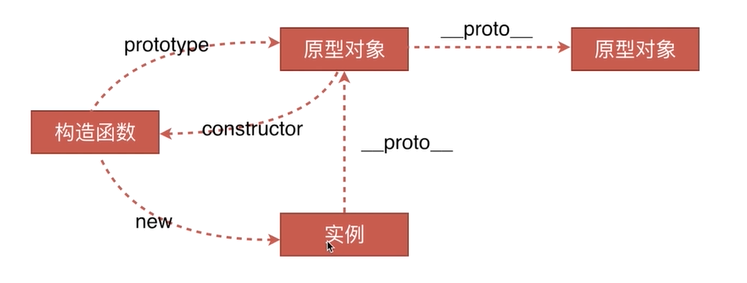
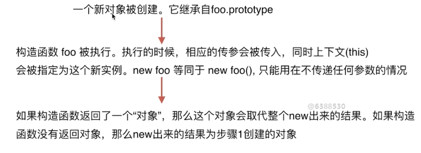

# js 基础

#### 1、值类型

-   基本类型：string、number、null、undefined、boolean、symbol。数据占用空间小，存储在栈中
-   引用类型：object，数据存储在堆中，地址存储在栈中，地址指向这个堆中的引用数据
-   JS 基本数据类型的变量存放的是基本类型数据的实际值；而引用数据类型的变量保存对它的引用，即指针

#### 2、typeof 运算符

-   识别所有值类型
-   识别函数=>function
-   识别是否是引用类型（但无法细分，需使用 instanceof）

#### 3、手写深拷贝

```js
/**
 * 深拷贝
 * @param {Object} obj 要拷贝的对象
 */
function deepClone(obj = {}) {
    if (typeof obj !== "object" || obj == null) {
        // obj 是 null ，或者不是对象和数组，直接返回
        return obj;
    }
    let result;
    if (obj instanceof Array) {
        result = [];
    } else {
        result = {};
    }

    for (let key in obj) {
        // 保证 key 不是原型的属性
        if (obj.hasOwnProperty(key)) {
            // 递归调用！！！
            result[key] = deepClone(obj[key]);
        }
    }
    return result;
}
```

> 通常可以通过 JSON.parse(JSON.stringify(obj)) 来解决，但是该方法也有局限性：
>
> -   会忽略 undefined
> -   会忽略 symbol (如：{ s: Symbol() } )
> -   不能序列化函数
> -   不能解决循环引用的对象

### 类型隐式转换

-   字符串拼接
-   ==（建议使用全等===）
-   if 语句及逻辑运算 (truly: !!a===true; falsely: !!a===false)

---

# 原型和原型链（重点）

创建对象常用方法：

```js
// 第一种方式：字面量
var o1 = { name: "o1" };
// 第二种方式：构造函数
var o2 = new Object({ name: "o2" });
var M = function (name) {
    this.name = name;
};
var o3 = new M("o3");
// 第三种方式：Object.create
var p = { name: "p" };
var o4 = Object.create(p); // p是o4的原型
```

### class 类（参考 es6）

### 1. 继承

-   extends(es6)
-   super(es6)
-   es5 的继承

```js
// es5中类的声明
var Animal = function () {
    this.name = "Animal";
};
// es6中class的声明
class Animal2 {
    constructor() {
        this.name = "Animal2";
    }
}
// 实例化
console.log(new Animal(), new Animal2());

/**
 * 1：借助构造函数实现继承
 */
function Parent1() {
    this.name = "parent1";
}
Parent1.prototype.say = function () {};
function Child1() {
    // 执行父类构造函数，父类this指向了子类
    Parent1.call(this); // important
    this.type = "child1";
}
console.log(new Child1());
// {
//   name: "parent1"
//   type: "child1"
// }
// 原理：执行父类构造函数，父类this指向了子类
// 缺点：无法继承父类的原型链
// new Child1().say() Uncaught TypeError: (intermediate value).say is not a function

/**
 * 2：借助原型链实现继承（可解决借助构造函数实现继承方式无法继承父类的原型链的缺点）
 */
function Parent2() {
    this.name = "parent2";
    this.play = [1, 2, 3];
}
Parent2.prototype.say = function () {};
function Child2() {
    this.type = "child2";
}
Child2.prototype = new Parent2();

var s1 = new Child2();
var s2 = new Child2();
console.log(s1.play, s2.play);
//  [1, 2, 3]  [1, 2, 3]
s1.play.push(4);
console.log(s1.play, s2.play);
//  [1, 2, 3, 4]  [1, 2, 3, 4]

// 原理：父类实例作为子类的原型对象
// 缺点： 原型链属性共用，引用同一个父类实例对象，改变某个实例原型上的属性会影响其他实例

/**
 * 3：组合方式
 */
function Parent3() {
    this.name = "parent3";
    this.play = [1, 2, 3];
}
function Child3() {
    Parent3.call(this); // important
    this.type = "child3";
}
Child3.prototype = new Parent3();
var s3 = new Child3();
var s4 = new Child3();
console.log(s3.play, s4.play);
//  [1, 2, 3]  [1, 2, 3]
s3.play.push(4);
console.log(s3.play, s4.play);
//  [1, 2, 3, 4]  [1, 2, 3]

// 原理：父类实例作为子类的原型对象，且在子类调用父类构造函数，将this指向子类
// 缺点：父类构造函数执行了2次: Parent3.call(this)，new Parent3()
// 特点：在子类中通过call 父类构造函数已经继承了父类属性，无需在原型链上再实例化多余的父类实例=>优化思路

/**
 * 4：组合继承的优化1
 * @type {String}
 */
function Parent4() {
    this.name = "parent4";
    this.play = [1, 2, 3];
}
function Child4() {
    Parent4.call(this);
    this.type = "child4";
}
Child4.prototype = Parent4.prototype; // 解决组合方式的 父类构造函数两次调用问题
var s5 = new Child4();
var s6 = new Child4();
console.log(s5, s6);

console.log(s5 instanceof Child4, s5 instanceof Parent4);
// true true
console.log(s5.constructor);
// ƒ Parent4 () {
//  this.name = 'parent4';
//  this.play = [1, 2, 3];
// }

// 缺点：constructor在prototype属性里，而Child4.prototype = Parent4.prototype，所以子类
// 实例的constructor指向了Parent4父类
// 无法区分父类、子类实例的构造函数
// 如果参考方式5：Child5.prototype.constructor = Child5，那就无法区分父类实例的构造函数

/**
 * 5：组合继承的优化2
 */
function Parent5() {
    this.name = "parent5";
    this.play = [1, 2, 3];
}
function Child5() {
    Parent5.call(this);
    this.type = "child5";
}
Child5.prototype = Object.create(Parent5.prototype);
Child5.prototype.constructor = Child5; // 确保constructor指向子类，不然还是指向父类

// 隔离父类和子类的原型对象，避免父类及子类的构造函数互相影响
```

### 2、instanceof 类型判断

内部机制是通过判断对象的原型链中是不是能找到类型的 prototype 原型

```js
function myInstanceof(left, right) {
    // 获得类型的原型
    let prototype = right.prototype;
    // 获得对象的原型
    left = left.__proto__;
    // 判断对象的类型是否等于类型的原型
    while (true) {
        if (left === null) return false;
        if (prototype === left) return true;
        left = left.__proto__;
    }
}
```

### 3、原型

-   class 实际上是函数，是语法糖
-   每个 class 都有显示原型 prototype
-   每个实例都有隐式原型**proto**
-   实例的**proto**指向对应 class 的 prototype

### 4、原型链(能画)




---

### 思考

#### 1、如何准确判断一个变量是数组

-   arr instanceof Array
-   Array.isArray(arr)
-   Object.prototype.toString.call(arr).slice(8,-1)

#### 2、class 的原型本质

-   原型和原型链图示
-   属性和方法的执行规则（顺着原型链一步步查找）

#### 3、手写建议 jQuery，考虑插件和扩展性

```js
class jQuery {
    constructor(selector) {
        const result = document.querySelectorAll(selector);
        const length = result.length;
        for (let i = 0; i < length; i++) {
            this[i] = result[i];
        }
        this.length = length;
        this.selector = selector;
    }
    get(index) {
        return this[index];
    }
    each(fn) {
        for (let i = 0; i < this.length; i++) {
            const elem = this[i];
            fn(elem);
        }
    }
    on(type, fn) {
        return this.each((elem) => {
            elem.addEventListener(type, fn, false);
        });
    }
    // 扩展很多 DOM API
}

// 插件
jQuery.prototype.dialog = function (info) {
    alert(info);
};

// "造轮子"
class myJQuery extends jQuery {
    constructor(selector) {
        super(selector);
    }
    // 扩展自己的方法
    addClass(className) {}
    style(data) {}
}

// const $p = new jQuery('p')
// $p.get(1)
// $p.each((elem) => console.log(elem.nodeName))
// $p.on('click', () => alert('clicked'))
```

# 作用域和闭包（重要）

作用域：变量能够合法使用的范围

-   全局作用域
-   函数作用域
-   块级作用域

作用域链:

-   变量的查找从当前作用域开始，如果找到即停止，没有找到则继续向上级作用域查找，直到全局作用域

闭包

-   有权访问另一个函数作用域中变量的函数，创建闭包的最常见的方式就是在一个函数内创建另一个函数，通过另一个函数访问这个函数的局部变量，利用闭包可以突破作用链域

闭包的特性：

-   函数内再嵌套函数
-   内部函数可以引用外层的参数和变量
-   参数和变量不会被垃圾回收机制回收

两种表现：

-   函数作为参数被传递
-   函数作为返回值被返回

```js
// 函数作为返回值
function create() {
    const a = 100;
    return function () {
        console.log(a);
    };
}

const fn = create();
const a = 200;
fn(); // 100
// fn 释放内存

// 函数作为参数被传递
function print(fn) {
    const a = 200;
    fn();
}
const a = 100;
function fn() {
    console.log(a);
}
print(fn); // 100

// 所有的自由变量的查找，是在函数定义的地方，向上级作用域查找
// 不是在执行的地方！！！
```

### 1、this 的应用场景，如何取值

[this 传送门](https://blog.csdn.net/weixin_37722222/article/details/81625826)

-   作为普通函数 => window
-   使用 call apply bind => 绑定的值
-   做为对象函数被调用 => 对象本身

```js
let obj = {
    a: 222,
    fn: function () {
        setTimeout(function () {
            console.log(this);
        });
    },
};
obj.fn(); // window

let obj2 = {
    a: 222,
    fn: function () {
        setTimeout(() => {
            console.log(this);
        });
    },
};
obj2.fn(); // obj
```

-   在 class 方法中调用 => 实例
-   构造函数调用 => 实例
-   箭头函数 => 上级作用域中的 this

**this 取值是在函数执行时确认，而不是在定义时执行**

#### 补充：new 运算符

```js
var new = function (func) {
  // 创建新对象o且o__proto__== func.prototype
  var o = Object.create(func.prototype);
  // 执行构造函数
  var k = func.call(o);
  if (typeof k === 'object'&& k !== null) {
      return k;
  } else {
      return o;
  }
};
```



#### 普通函数和箭头函数的区别

-   箭头函数是匿名函数，不能作为构造函数，不能使用 new
-   箭头函数不绑定 arguments，取而代之用 rest 剩余参数解决
-   this 的作用域不同，箭头函数不绑定 this，会捕获其所在上下文的 this 值，作为自己的 this 值
-   箭头函数没有原型属性
-   箭头函数不能当做 Generator 函数,不能使用 yield 关键字

### 2、手写 bind、call 及 apply 函数

```js
// 模拟bind
Function.prototype.myBind = function (context, ...outerArgs) {
    let self = this;
    //返回了一个函数，...innerArgs为实际调用时传入的参数
    return function F(...innerArgs) {
        // 对于 new 的情况来说，不会被任何方式改变 this，所以对于这种情况我们需要忽略传入的 this
        if (this instanceof F) {
            return new self(...outerArgs, ...innerArgs);
        }
        // bind 可以实现类似这样的代码 f.bind(obj, 1)(2)，所以我们需要将两边的参数拼接起来
        //返回改变了this的函数，参数合并
        return self.apply(context, [...outerArgs, ...innerArgs]);
    };
};

const fn3 = fn.myBind({ x: 2 }, 3, 4);
```

```js
// 模拟call
Function.prototype.myCall = function (context) {
    var context = context || window;
    // 给 context 添加一个属性
    // getValue.call(a, 'yck', '24') => a.fn = getValue
    context.fn = this;
    // 将 context 后面的参数取出来
    var args = [...arguments].slice(1);
    // getValue.call(a, 'yck', '24') => a.fn('yck', '24')
    var result = context.fn(...args);
    // 删除 fn
    delete context.fn;
    return result;
};
```

```js
// 模拟apply
Function.prototype.myApply = function (context) {
    var context = context || window;
    context.fn = this;
    var result;
    // 需要判断是否存储第二个参数，如果存在，就将第二个参数展开
    if (arguments[1]) {
        result = context.fn(...arguments[1]);
    } else {
        result = context.fn();
    }
    delete context.fn;
    return result;
};
```

### 3、实际开发中闭包的应用场景

-   闭包的最大用处有两个，一个是可以读取函数内部的变量，另一个就是让这些变量始终保持在内存中
-   另一个用处是封装对象的私有属性和私有方法

**案例：隐藏数据**

```js
// 闭包隐藏数据，只提供 API
function createCache() {
    const data = {}; // 闭包中的数据，被隐藏，不被外界访问
    return {
        set: function (key, val) {
            data[key] = val;
        },
        get: function (key) {
            return data[key];
        },
    };
}

const c = createCache();
c.set("a", 100);
console.log(c.get("a"));
```

**案例：做一个简单的 cache 工具**

-   如：节流防抖、数据缓存等

**使用闭包的注意点**

-   闭包会使得函数中的变量都被保存在内存中，内存消耗很大，所以不能滥用闭包，否则会造成网页的性能问题，在 IE 中可能导致内存泄露
-   解决方法是，在退出函数之前，将不使用的局部变量全部删除

---

# 异步与单线程（重要）

-   单线程与异步
    -   js 是单线程语言，只能同时做一件事
    -   浏览器和 nodejs 已支持 js 启动进程，如 Web Worker
    -   js 和 DOM 渲染共用同一线程，因为 js 可以修改 DOM 结构
    -   遇到等待，不能卡住，所以需要异步（不阻塞代码执行）
-   es6 前：callback hell
-   es6+：promise、generator、async/await

### 1、同步与异步的区别

基于 js 是单线程本质，异步不会阻塞代码执行，同步会阻塞

### 2、手写 promise 加载一张图片

```js
function loadImg(src) {
    const p = new Promise((resolve, reject) => {
        const img = document.createElement("img");
        img.onload = () => {
            resolve(img);
        };
        img.onerror = () => {
            const err = new Error(`图片加载失败 ${src}`);
            reject(err);
        };
        img.src = src;
    });
    return p;
}
```

### 3、前端使用异步的应用场景

-   网络请求，如 ajax 请求
-   定时任务，如 setTimeout、setInterval

---

# js 异步-进阶(重要)

-   event loop
-   promise 进阶
-   async/await
-   微任务/宏任务

### 思考题:

-   请描述 event loop（事件循环/事件轮询）的机制
-   什么是宏任务和微任务，两者有什么区别
-   promise 有哪三种状态，如何变化
-   场景题：promise then 和 catch 的连接
-   async/await 语法
-   promise 和 setTimeout 的顺序
-   外加 async/await 的顺序问题

**promise**

-   三种状态
    -   pending
    -   resolved
    -   rejected
-   pending=>resolved 或者 pending=>rejected，结果不可逆
-   pending 状态，不会触发 then 和 catch
-   resolved 状态，触发后续 then 回调函数
-   rejected 状态，触发后续 catch 回调函数或者 then 回调函数（第二个参数）

**then 和 catch 改变状态(重要)**

-   then 正常返回 resolved，里面有报错则返回 rejected
-   catch 正常返回 resolved，里面有报错则返回 rejected

```js
// 第一题
Promise.resolve()
    .then(() => {
        console.log(1); // 1
    })
    .catch(() => {
        console.log(2);
    })
    .then(() => {
        console.log(3); // 3
    });

// 第二题
Promise.resolve()
    .then(() => {
        // 返回 resolved 状态的 promise
        console.log(1); // 1
        throw new Error("erro1");
    })
    .catch(() => {
        // 返回 rejected 状态的 promise
        console.log(2); // 2
    })
    .then(() => {
        console.log(3); // 3
    });

// 第三题
Promise.resolve()
    .then(() => {
        // 返回 resolved 状态的 promise
        console.log(1); // 1
        throw new Error("erro1");
    })
    .catch(() => {
        // 返回 rejected 状态的 promise
        console.log(2); // 2
    })
    .catch(() => {
        console.log(3);
    });
```

# async/await

-   语法介绍
-   和 Promise 的关系
-   异步本质
-   for...of

**有很多 async 的面试题，例如**

-   async 直接返回，是什么? => promise
-   await 后面不加 promise，会怎样

## 语法介绍

用同步的方式，编写异步

```js
function loadImg(src) {
    const promise = new Promise((resolve, reject) => {
        const img = document.createElement("img");
        img.onload = () => {
            resolve(img);
        };
        img.onerror = () => {
            reject(new Error(`图片加载失败 ${src}`));
        };
        img.src = src;
    });
    return promise;
}

async function loadImg1() {
    const src1 = "http://www.imooc.com/static/img/index/logo_new.png";
    const img1 = await loadImg(src1);
    return img1;
}

async function loadImg2() {
    const src2 = "https://avatars3.githubusercontent.com/u/9583120";
    const img2 = await loadImg(src2);
    return img2;
}

(async function () {
    // 注意：await 必须放在 async 函数中，否则会报错
    try {
        // 加载第一张图片
        const img1 = await loadImg1();
        console.log(img1);
        // 加载第二张图片
        const img2 = await loadImg2();
        console.log(img2);
    } catch (ex) {
        console.error(ex);
    }
})();
```

## 和 Promise 的关系(重要)

-   async 函数返回结果都是 Promise 对象（如果函数内没返回 Promise ，则自动封装一下）

```js
async function fn2() {
    return new Promise(() => {});
}
console.log(fn2());

async function fn1() {
    return 100;
}
// 相当于 Promise.resolve(100)
console.log(fn1());
```

-   await 后面跟 Promise 对象：**会阻断后续代码，等待状态变为 resolved，才获取结果并继续执行，不然就会阻断**
-   await 后续跟非 Promise 对象：会直接返回，不再继续执行后续代码

```js
(async function () {
    const p1 = new Promise(() => {});
    await p1;
    console.log("p1"); // 不会执行
})()(async function () {
    const p2 = Promise.resolve(100);
    const res = await p2;
    console.log(res); // 100
})()(async function () {
    const res = await 100;
    console.log(res); // 100
})()(async function () {
    const p3 = Promise.reject("some err");
    const res = await p3;
    console.log(res); // 不会执行
})();
```

-   try...catch 捕获 rejected 状态

```js
(async function () {
    const p4 = Promise.reject("some err");
    try {
        const res = await p4;
        console.log(res);
    } catch (ex) {
        console.error(ex);
    }
})();
```

总结来看：

-   async 封装 Promise
-   await 处理 Promise resolved（相当于 Promise.then）
-   try...catch 处理 Promise 失败

## 异步本质

await 是同步写法，但本质还是异步调用。

```js
async function async1() {
    console.log("async1 start");
    await async2();
    // await 后面的代码都可以看做是回调中的内容，即异步 important
    console.log("async1 end"); // 关键在这一步，它相当于放在 callback 中，最后执行
}

async function async2() {
    console.log("async2");
}

console.log("script start");
async1();
console.log("script end");

// script start
// async1 start
// async2
// script end
// async1 end
```

即，只要遇到了 `await` ，后面的代码都相当于放在 callback 里。

## for...of

```js
// 定时算乘法
function multi(num) {
    return new Promise((resolve) => {
        setTimeout(() => {
            resolve(num * num);
        }, 1000);
    });
}

// // 使用 forEach ，是 1s 之后打印出所有结果，即 3 个值是一起被计算出来的
// function test1 () {
//     const nums = [1, 2, 3];
//     nums.forEach(async x => {
//         const res = await multi(x);
//         console.log(res);
//     })
// }
// test1();

// 使用 for...of ，可以让计算挨个串行执行
async function test2() {
    const nums = [1, 2, 3];
    for (let x of nums) {
        // 在 for...of 循环体的内部，遇到 await 会挨个串行计算
        const res = await multi(x);
        console.log(res);
    }
}
test2();
```

---

# 宏任务和微任务

-   宏任务：setTimeout setInterval DOM 事件 AJAX
-   微任务：Promise（对于前端来说）
-   微任务比宏任务执行的更早（在不考虑 script 宏任务的前提下，参考上述思考题）

```js
console.log(100);
setTimeout(() => {
    console.log(200);
});
Promise.resolve().then(() => {
    console.log(300);
});
console.log(400);
// 100 400 300 200
```

## event loop 和 DOM 渲染

再次回顾 event loop 的过程

-   每一次 call stack 结束，都会触发 DOM 渲染（不一定非得渲染，就是给一次 DOM 渲染的机会！！！）
-   然后再进行 event loop

```js
const $p1 = $("<p>一段文字</p>");
const $p2 = $("<p>一段文字</p>");
const $p3 = $("<p>一段文字</p>");
$("#container").append($p1).append($p2).append($p3);

console.log("length", $("#container").children().length);
alert("本次 call stack 结束，DOM 结构已更新，但尚未触发渲染");
// （alert 会阻断 js 执行，也会阻断 DOM 渲染，便于查看效果）
// 到此，即本次 call stack 结束后（同步任务都执行完了），浏览器会自动触发渲染，不用代码干预

// 另外，按照 event loop 触发 DOM 渲染时机，setTimeout 时 alert ，就能看到 DOM 渲染后的结果了
setTimeout(function () {
    alert("setTimeout 是在下一次 Call Stack ，就能看到 DOM 渲染出来的结果了");
});
```

## 宏任务和微任务的区别

-   宏任务：DOM 渲染后再触发
-   微任务：DOM 渲染前会触发

```js
// 修改 DOM
const $p1 = $("<p>一段文字</p>");
const $p2 = $("<p>一段文字</p>");
const $p3 = $("<p>一段文字</p>");
$("#container").append($p1).append($p2).append($p3);

// // 微任务：渲染之前执行（DOM 结构已更新）
// Promise.resolve().then(() => {
//     const length = $('#container').children().length
//     alert(`micro task ${length}`)
// })

// 宏任务：渲染之后执行（DOM 结构已更新）
setTimeout(() => {
    const length = $("#container").children().length;
    alert(`macro task ${length}`);
});
```

再深入思考一下：为何两者会有以上区别，一个在渲染前，一个在渲染后？

-   执行 ES6 语法规范的是 js 引擎，制定宏任务的是浏览器，不是一个模块。
-   所以，微任务是 ES6 语法的一部分，那也就顺带让 js 引擎直接给执行了，这样效率最高。
-   等 ES6 语法全部执行完（包括微任务）之后，再去执行浏览器该有的操作（如渲染、宏任务）

# 异步 题目

-   描述 event loop 运行机制
-   Promise 哪几种状态，如何变化？
-   宏任务和微任务的区别
-   场景题：Promise catch 连接 then
-   场景题：Promise 和 setTimeout 顺序
-   场景题：各类异步执行顺序问题

## Promise catch 连接 then

```js
// 第一题
Promise.resolve()
    .then(() => {
        console.log(1);
    })
    .catch(() => {
        console.log(2);
    })
    .then(() => {
        console.log(3);
    });
// 1 3

// 第二题
Promise.resolve()
    .then(() => {
        console.log(1);
        throw new Error("erro1");
    })
    .catch(() => {
        console.log(2);
    })
    .then(() => {
        console.log(3);
    });
// 1 2 3

// 第三题
Promise.resolve()
    .then(() => {
        console.log(1);
        throw new Error("erro1");
    })
    .catch(() => {
        console.log(2);
    })
    .catch(() => {
        // 注意这里是 catch
        console.log(3);
    });
// 1 2
```

## async/await 语法问题

```js
async function fn() {
    return 100;
}
(async function () {
    const a = fn(); // ??               // promise
    const b = await fn(); // ??         // 100
})();
```

```js
(async function () {
    console.log("start");
    const a = await 100;
    console.log("a", a);
    const b = await Promise.resolve(200);
    console.log("b", b);
    const c = await Promise.reject(300); // 注意是reject
    console.log("c", c);
    console.log("end");
})(); // 执行完毕，打印出那些内容？
// start -> a 100 -> b 200
```

## Promise 和 setTimeout 顺序

```js
console.log(100);
setTimeout(() => {
    console.log(200);
});
Promise.resolve().then(() => {
    console.log(300);
});
console.log(400);
// 100 400 300 200
```

## 执行顺序问题

网上很经典的面试题

```js
async function async1() {
    console.log("async1 start"); // 2
    await async2(); // 这一句会同步执行，返回 Promise ，其中的 `console.log('async2')` 也会同步执行
    console.log("async1 end"); // 上面有 await ，下面就变成了“异步”，类似 callback 的功能（微任务） // 6
}

async function async2() {
    console.log("async2"); // 3
}

console.log("script start"); // 1

setTimeout(function () {
    // 异步，宏任务
    console.log("setTimeout"); // 8
}, 0);

async1();

new Promise(function (resolve) {
    // 返回 Promise 之后，即同步执行完成，then 是异步代码
    console.log("promise1"); // Promise 的函数体会立刻执行 // 4
    resolve();
}).then(function () {
    // 异步，微任务
    console.log("promise2"); // 7
});

console.log("script end"); // 5

// 同步代码执行完之后，屡一下现有的异步未执行的，按照顺序
// 1. async1 函数中 await 后面的内容 —— 微任务
// 2. setTimeout —— 宏任务
// 3. then —— 微任务
// script start
// async1 start
// async2
// promise1
// script end
// async1 end
// promise2
// setTimeout
```
