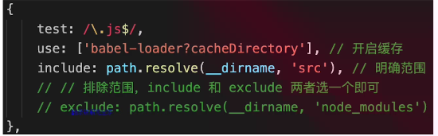
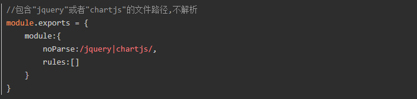
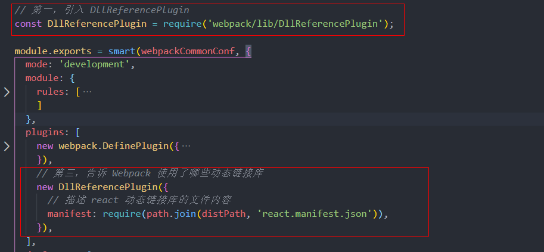
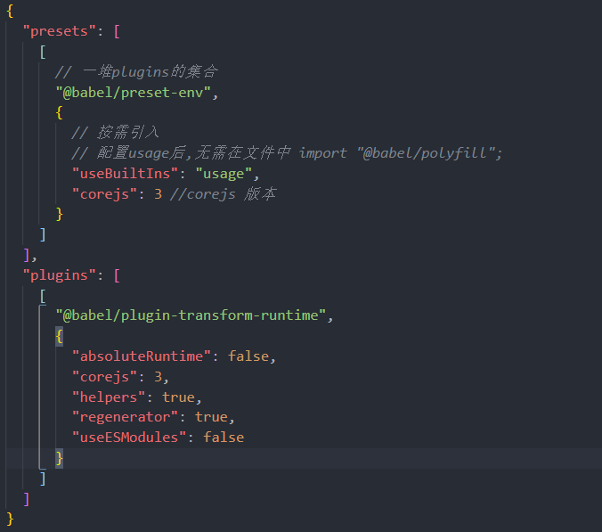

# Webpack篇
webpack已是前端打包构建的不二选择，重在配置和使用，不在原理  

[Webpack官网](https://webpack.docschina.org/concepts/)
- 基本配置  
- 高级配置  
- 优化打包速度  
- 优化产出代码    
- Babel  

### 1）Webpack基本配置（必须掌握）  

#### 1：拆分配置和merge
通常将公共配置、开发环境配置和生产环境配置分别进行设置，然后通过merge将公共配置和开发或生产配置进行合并，根据scripts命令启用合并后的配置，依此构建项目


#### 2：启动本地服务
webpack-dev-server插件   
devServer 配置项
```
var path = require('path');
module.exports = {
  //...
  devServer: {
    contentBase: path.join(__dirname, 'dist'),
    compress: true,
    port: 9000,
  },
};
```

#### 3：处理es6
babel-loader .babelrc文件 polyfill

#### 4：处理样式
style-loader、css-loader、scss-loader等css预处理loader、postcss-loader(配合autoprefixer添加厂商前缀)

#### 5：处理图片
file-loader/url-loader(配合options limit 配置项可以控制是否按base64格式产出)

---

### 2）Webpack高级配置（必须掌握）  

#### 1：多入口
```
// 多个entry 
module.exports = {
  entry: {
    main: 'xxx1', // 入口1
    index: 'xxx2' // 入口2
  },
  output: {
    filename: '[name].[contentHash:8].js', // 使用8位contentHash命名入口chunk
    path: path.resolve(__dirname, 'dist'),
  }
}
```


#### 2：抽离css文件
常用于生产环境，开发环境没有必要(减少不必要的处理，加快构建速度，使用style-loader即可)  
可以使用 enforce 强制执行 loader 的作用顺序，pre 代表在所有正常 loader 之前执行，post 是所有 loader 之后执行。(inline 官方不推荐使用)  


官网中提到的extract-text-webpack-plugin插件要依赖webpack3的版本。

#### 3：抽离公共代码（重要）
抽离公共代码及第三方代码，splitChunksPlugin（webpack已经内置）  
如果node_modules包过大，还可以对node_modules里较大的包拆分提取出来，避免输出的bundle文件过大  
```
splitChunks = {
  // ...
  cacheGroups: {
    elementUI: {
      name: 'chunk-elementUI', // 单独将 elementUI 拆包
      priority: 15, // 权重需大于其它缓存组
      test: /[\/]node_modules[\/]element-ui[\/]/
    }
  }
};
```


#### 4：实现异步加载
import(/*webpackChunkName: chunkName */  '待引入的chunk') 使用魔术注释法对输出bundle进行命名，默认使用id命名 
   


#### 5：处理JSX和vue
配合使用对应的loader即可
```
const module = {
  rules: [
    {
      test: /\.(js|jsx)$/,
      exclude: /(node_modules|bower_components)/,
      use: {
        loader: 'babel-loader',
        options: {
          presets: ['@babel/preset-env', '@babel/preset-react']
        }
      }
    }
  ]
};
```


#### 6：module chunk bundle 的区别
- module：各源文件，在webpack中，一切皆模块  
- chunk：多个模块合并合成的，比如entry、import()、splitChunk  
- bundle：最终输出文件  

---

### 3）webpack性能优化(重要）

- 优化打包构建速度---开发体验和效率  
- 优化产出代码---产品性能  

#### 1）优化打包构建速度
##### 1：优化babel-loader
- 开启缓存，未修改过的es6+代码，就不会重新编译  
- 限定打包范围 include or exclude(exclude优先级高于前者)



##### 2：IgnorePlugin
忽略第三方包指定目录，让这些指定目录不要被打包进去


```
new webpack.IgnorePlugin({
  resourceRegExp: /^\.\/locale$/,
  contextRegExp: /moment$/,
});
```
moment这个库中，如果引用了./locale/目录的内容，就忽略掉，不会打包进去

##### 3：noParse
用了noParse的模块将不会被loaders解析，所以当我们使用的库如果太大，并且其中不包含import、require、define的调用，我们就可以使用这项配置来提升性能， 让 Webpack 忽略对部分没采用模块化的文件的递归解析处理。



##### 4：happyPack（多进程打包）
多进程打包，提高构建速度（特别是多核CPU）


##### 5：ParallelUglifyPlugin（多进程压缩js，常用于生产环境）
webpack内置Uglify工具压缩js（单进程）

项目较大，打包较慢时，开启多进程能提高速度  
项目较小，打包很快，开启多进程可能会降低速度（进程开销）  
所以，按需使用


##### 6：自动刷新（开发环境）
启动webpack-dev-server会自动开启该功能


##### 7：热更新（开发环境）
模块热更新是webpack的一个功能，它可以使得代码修改之后，不用刷新浏览器就可以更新。在应用过程中替换添加删除模块，无需重新加载整个页面，是高级版的自动刷新浏览器。  

优点：  
只更新变更内容，以节省宝贵的开发时间。调整样式更加快速，几乎相当于在浏览器中更改样式  


##### 8：DllPlugin 动态链接库插件（开发环境）
前端框架如vue React，体积大，构建慢  
较稳定，不常升级  
同一版本只构建一次即可，不用每次都重新构建  

webpack 已经内置DllPlugin支持  
DllPlugin---打包出dll文件（类似于第三方库）  
DllReferencePlugin---使用dll文件  




再将react.dll.js文件引入html模板中即可（切勿忘记）

#### 9：缩小文件的搜索范围(配置include exclude alias noParse extensions)
alias: 当我们代码中出现 import 'vue'时， webpack会采用向上递归搜索的方式去node_modules 目录下找。为了减少搜索范围我们可以直接告诉webpack去哪个路径下查找。也就是别名(alias)的配置。  
include exclude 同样。配置include exclude也可以减少webpack loader的搜索转换时间。  
extensions：webpack会根据extensions定义的后缀查找文件(频率较高的文件类型优先写在前面) 

#### 10：尽量使用高版本的webpack 和node
webpack4 发布时，官方也曾表示，其编译速度提升了 60% ~ 98%。  

#### 2）优化产出代码（比构建速度更重要）
- 体积更小  
- 合理分包，不重复加载  
- 速度更快，内存使用更小（代码执行更快）  

##### 1：小图片base64编码 (配合url-loader limit配置项)
##### 2：bundle加hash （使用contentHash，只有文件变更后才加载新内容）
##### 3：懒加载 import()
##### 4：提取公共代码(splitChunksPlugin)
##### 5：IngorePlugin （忽略第三方包指定目录，让这些指定目录不要被打包进去）
##### 6：使用CDN加速（通过配置publicPath）
CDN的全称是(Content Delivery Network)，即内容分发网络。其目的是通过在现有的Internet中增加一层新的CACHE(缓存)层，将网站的内容发布到最接近用户的网络”边缘“的节点，使用户可以就近取得所需的内容，提高用户访问网站的响应速度。从技术上全面解决由于网络带宽小、用户访问量大、网点分布不均等原因，提高用户访问网站的响应速度。
简单的说，CDN的工作原理就是将您源站的资源缓存到位于全球各地的CDN节点上，用户请求资源时，就近返回节点上缓存的资源，而不需要每个用户的请求都回您的源站获取，避免网络拥塞、缓解源站压力，保证用户访问资源的速度和体验  
##### 7：使用production模式
自动开启代码压缩、Vue/React等会自动删掉调试代码（如开发环境的warning），自动启动tree-shaking  

为了学会使用 tree shaking，你必须:  
- 使用 ES2015 模块语法（即 import 和 export）
- 在项目 package.json 文件中，添加一个 "sideEffects" 入口(注意，任何导入的文件都会受到 tree shaking 的影响。这意味着，如果在项目中使用类似 css-loader 并导入 CSS 文件，则需要将其添加到 side effect 列表中，以免在生产模式中无意中将它删除)
- 引入一个能够删除未引用代码(dead code)的压缩工具(minifier)
```
// 开启 tree shaking
 optimization: {
   usedExports: true,
 },
```
备注：ES6 Module和Commonjs区别  
- ES6 Module是静态引入，编译时引入，Commonjs是动态引入，执行时引入，所以只有ES6 - Module才能静态分析，实现Tree-Shaking


##### 8：Scope Hoisting
- 代码体积更小  
- 创建函数作用域更少  
- 代码可读性更好  
- Scope Hoisting 它可以让webpack打包出来的代码文件更小，运行更快，它可以被称作为 "作用域提升"。
[Scope Hoisting](https://blog.csdn.net/qq_36380426/article/details/107298332)


---

### 4）babel 
[babel官网](https://www.babeljs.cn/setup#installation)    
需要了解基本的配置和使用，考察概率不高，但必须会  

#### 1）环境搭建+基本配置
环境搭建  
.babelrc配置 
presets和plugins  
(preset 可以作为 Babel 插件的组合)

备注:  
Babel默认只转换新的JavaScript语法(如箭头函数)，而不转换新的API。 例如，Iterator、Generator、Set、Maps、Proxy、Reflect、Symbol、Promise 等全局对象，以及一些定义在全局对象上的方法(比如 Object.assign)都不会转译。 如果想使用这些新的对象和方法，则需要为当前环境提供一个polyfill

#### 2）babel-polyfill
NOTE:  
As of Babel 7.4.0, this package has been deprecated in favor of directly including core-js/stable (to polyfill ECMAScript features) and regenerator-runtime/runtime (needed to use transpiled generator functions)
```
With webpack, there are multiple ways to include the polyfills:

When used alongside @babel/preset-env,

If useBuiltIns: 'usage' is specified in .babelrc then do not include @babel/polyfill in either webpack.config.
js entry array nor source. Note, @babel/polyfill still needs to be installed.

If useBuiltIns: 'entry' is specified in .babelrc then include @babel/polyfill at the top of the entry point to your 
application via require or import as discussed above.

If useBuiltIns key is not specified or it is explicitly set with useBuiltIns: false in your .babelrc, 
add @babel/polyfill directly to the entry array in your webpack.config.js.
```

**babel-polyfill 存在的问题:** 

***会污染全局环境***  
- 如果做的是web系统，没有关系。如果作为一个library库，则会有负面影响  
- 解决方案：babel-runtime  
- 故如果输出的web系统，使用babel-polyfill，如果输出library库，使用babel-runtime

#### 3）babel-runtime  
@babel/plugin-transform-runtime



---

### 5）面试真题
#### 1：前端为何要进行打包和构建
- 体积更小（Tree-Shaking、压缩、合并），加载更快  
- 编译高级语言或者语法（TS、ES6+、模块化、scss）  
- 兼容性和错误检查（polyfill、postcss、eslint）  
- 统一、高效的开发环境  
- 统一的构建流程和产出标准  
- 集成公司构建规范（提测、上线等）  

#### 2：module chunk bundle的区别
- module：各源文件,在webpack中,一切皆模块  
- chunk：多个模块合并合成的,比如entry import() splitChunk  
- bundle：最终输出文件  

#### 3：loader和plugin的区别
- loader模块转换器，如less->css  
- plugin扩展插件，如HtmlWebpackPlugin  
- 相对于loader转换指定类型的模块功能，plugins能够被用于执行更广泛的任务比如打包优化、文件管理、环境注入等  

#### 4：常见loader和plugin有哪些
参考官网  
[常见loader和plugin](https://blog.csdn.net/Cao_Mary/article/details/104465872)

#### 5：babel和webpack的区别
- Babel---js新语法编译工具，不关心模块化  
- Webpack---打包构建工具，是多个loader plugin的集合  
- Babel 是编译工具，把高版本语法编译成低版本语法，或者将文件按照自定义规则转换成js语法。 
- webpack 是打包工具，定义入口文件，将所有模块引入整理后，通过loader和plugin处理后，打包输出。 webpack 通过 babel-loader 使用 Babel 。  

#### 6：如何产出一个lib
参考DllPlugin章节
output.library

#### 7：babel-polyfill 和babel-runtime的区别
前者会污染全局，后者不会，产出第三方lib要用babel-runtime

#### 8：webpack 如何实现懒加载
import()  
结合Vue React 异步组件  
结合Vue-router React-router异步加载路由  

#### 9：为何Proxy不能被Polyfill
- Class 可以用function模拟  
- Promise可以用callback模拟  
- 但是Proxy的功能用Object.defineProperty模拟

#### 10：优化构建速度
参考之前章节

#### 11：优化产出代码
参考之前章节

#### 12：如何对bundle体积进行监控和分析？
VSCode 中有一个插件 Import Cost 可以帮助我们对引入模块的大小进行实时监测，还可以使用 webpack-bundle-analyzer 生成 bundle 的模块组成图，显示所占体积。

#### 13：说一下 Webpack 的热更新原理吧(敲黑板，这道题必考)

Webpack 的热更新又称热替换（Hot Module Replacement），缩写为 HMR。这个机制可以做到不用刷新浏览器而将新变更的模块替换掉旧的模块。  

HMR的核心就是客户端从服务端拉取更新后的文件，准确的说是 chunk diff (chunk 需要更新的部分)，实际上 WDS 与浏览器之间维护了一个 Websocket，当本地资源发生变化时，WDS 会向浏览器推送更新，并带上构建时的 hash，让客户端与上一次资源进行对比。客户端对比出差异后会向 WDS 发起 Ajax 请求来获取更改内容(文件列表、hash)，这样客户端就可以再借助这些信息继续向 WDS 发起 jsonp 请求获取该chunk的增量更新。

后续的部分(拿到增量更新之后如何处理？哪些状态该保留？哪些又需要更新？)由 HotModulePlugin 来完成，提供了相关 API 以供开发者针对自身场景进行处理，像react-hot-loader 和 vue-loader 都是借助这些 API 实现 HMR。

[细节请参考Webpack HMR 原理解析](https://zhuanlan.zhihu.com/p/30669007)

#### 14：文件监听原理
在发现源码发生变化时，自动重新构建出新的输出文件。

Webpack开启监听模式，有两种方式：

启动 webpack 命令时，带上 --watch 参数  
在配置 webpack.config.js 中设置 watch:true  
缺点：每次需要手动刷新浏览器  

原理：轮询判断文件的最后编辑时间是否变化，如果某个文件发生了变化，并不会立刻告诉监听者，而是先缓存起来，等 aggregateTimeout 后再执行。
```
module.export = {
    // 默认false,也就是不开启
    watch: true,
    // 只有开启监听模式时，watchOptions才有意义
    watchOptions: {
        // 默认为空，不监听的文件或者文件夹，支持正则匹配
        ignored: /node_modules/,
        // 监听到变化发生后会等300ms再去执行，默认300ms
        aggregateTimeout:300,
        // 判断文件是否发生变化是通过不停询问系统指定文件有没有变化实现的，默认每秒问1000次
        poll:1000
    }
}
```
#### 15：source map是什么？生产环境怎么用？
source map 是将编译、打包、压缩后的代码映射回源代码的过程。打包压缩后的代码不具备良好的可读性，想要调试源码就需要 soucre map。

map文件只要不打开开发者工具，浏览器是不会加载的。

线上环境一般有三种处理方案：  
hidden-source-map：借助第三方错误监控平台 Sentry 使用  
nosources-source-map：只会显示具体行数以及查看源代码的错误栈。安全性比 sourcemap 高  
sourcemap：通过 nginx 设置将 .map 文件只对白名单开放(公司内网)    
注意：避免在生产中使用 inline- 和 eval-，因为它们会增加 bundle 体积大小，并降低整体性能。  

**常用source-map**
- eval： 生成代码 每个模块都被eval执行，并且存在@sourceURL  
- cheap-eval-source-map： 转换代码（行内） 每个模块被eval执行，并且sourcemap作为- eval的一个dataurl  
- cheap-module-eval-source-map： 原始代码（只有行内） 同样道理，但是更高的质量和更低的性能  
- eval-source-map： 原始代码 同样道理，但是最高的质量和最低的性能  
- cheap-source-map： 转换代码（行内） 生成的sourcemap没有列映射，从loaders生成的- sourcemap没有被使用  
- cheap-module-source-map： 原始代码（只有行内） 与上面一样除了每行特点的从loader中进行映射  
- source-map： 原始代码 最好的sourcemap质量有完整的结果，但是会很慢  


**各部分含义**
- eval： 使用eval包裹模块代码  
- source-map： 产生.map文件  
- cheap： 不包含列信息（关于列信息的解释下面会有详细介绍)也不包含loader的sourcemap 
- module： 包含loader的sourcemap（比如jsx to js ，babel的sourcemap）  
- inline： 将.map作为DataURI嵌入，不单独生成.map文件（这个配置项比较少见）  
