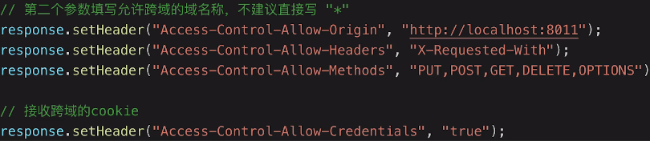

# AJAX

### 题目
- 书写一个简易的ajax
- 跨域的常用实现方式
  
### 知识点
- XMLHttpReguest
- 状态码
- 跨域：同源策略，跨域解决方案

### 1. XMLHttpReguest
```js
/** 1. 创建XMLHttpRequest对象 **/
var xhr = null;
xhr = new XMLHttpRequest()
/** 2. 连接服务器 **/
xhr.open('get', url, true)
/** 3. 发送请求 **/
xhr.send(null);
/** 4. 接受请求 **/
xhr.onreadystatechange = function () {
  if (xhr.readyState == 4) {
    if (xhr.status == 200) {
      success(xhr.responseText);
    } else {
      /** false **/
      fail && fail(xhr.status);
    }
  }
}
```

**xhr.readyState**
- 0－（未初始化）还没有调用send()方法
- 1－（载入）已调用send()方法，正在发送请求
- 2－（载入完成）send()方法执行完成，已经接收到全部响应内容
- 3－（交互）正在解析响应内容
- 4－（完成）响应内容解析完成，可以在客户端调用了
  
### 2. 跨域

#### 同源策略
- ajax请求时，浏览器要求当前网页和服务必须同源（安全）
- 同源：协议、域名、端口，三者必须一致
- 加载图片、css、js可无视同源策略
- 所有跨域，都必须通过服务端允许和配合
- 未经服务端允许就实现跨域，说明浏览器有漏洞，危险信号

#### 跨域方案
- JSONP
> JSONP 的原理：利用 `<script>`标签没有跨域限制的漏洞。通过`<script>`标签指向一个需要访问的地址并提供一个回调函数来接收数据  
> JSONP 使用简单且兼容性不错，但是只限于 get 请求
> ```js
>   var script = document.createElement('script');
>   script.type = 'text/javascript';
> 
>   // 传参并指定回调执行函数为onBack
>   script.src = 'http://www.....:8080/login?user=admin&callback=onBack';
>   document.head.appendChild(script);
> 
>   // 回调执行函数
>   function onBack(res) {
>     alert(JSON.stringify(res));
>   }
> ```
- cors 服务器设置http header


- nginx代理跨域
- webpack-dev-server(仅适用于开发环境)

### 题目
- 书写一个简易的ajax
```js
function ajax (url) {
  const p = new Promise((resolve, reject) => {
    const xhr = new XMLHttpRequest()
    xhr.open('GET', url, true) // true表示异步请求
    xhr.onreadystatechange = function () {
      if (xhr.readyState === 4) {
        if (xhr.status === 200) {
          resolve(JSON.parse(xhr.responseText))
        } else if (xhr.status === 404) {
          reject(new Error('404 not found'))
        }else if ( xhr.status === 500) {
          reject(new Error('500 server error'))
        }
      }
    }
    xhr.send(null)
  })
  return p
}
```
- 跨域的常用实现方式
   - JSONP
   - cors 服务器设置http header
   - nginx代理跨域
   - webpack-dev-server

### 3. fetch
### 4. axios