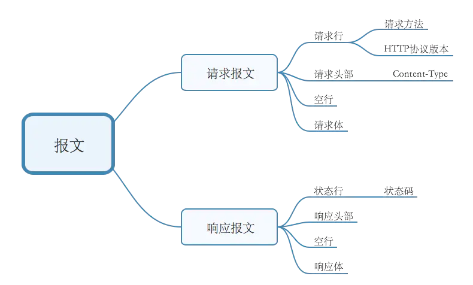
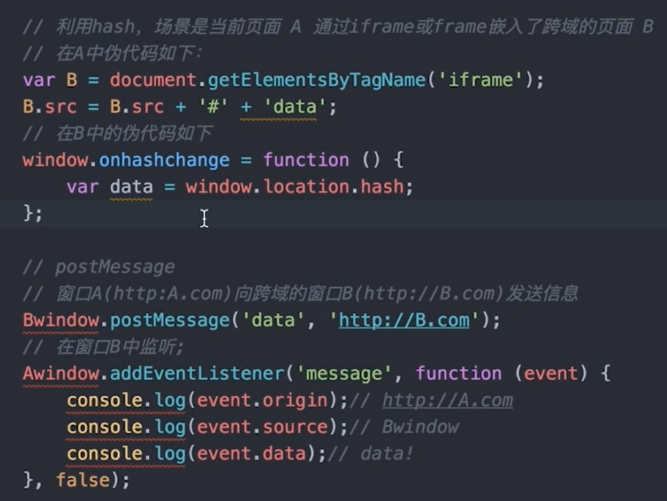

# http 篇

[HTTP 灵魂之问，巩固你的 HTTP 知识体系](https://juejin.cn/post/6844904100035821575)  
[HTTP 和 HTTPS 协议，看一篇就够了](https://blog.csdn.net/xiaoming100001/article/details/81109617?utm_medium=distribute.pc_relevant.none-task-blog-2%7Edefault%7EBlogCommendFromMachineLearnPai2%7Edefault-2.control&dist_request_id=1328769.61120.16176364131335951&depth_1-utm_source=distribute.pc_relevant.none-task-blog-2%7Edefault%7EBlogCommendFromMachineLearnPai2%7Edefault-2.control)

### 思考题

- http 常见的状态码有哪些
- http 常见的 header 有哪些
- 什么是 Restful API
- 描述一下 http 的缓存机制（重要）

#### HTTP 协议特点：

- 无连接：含义是限制每次连接只处理一个请求。服务器处理完客户的请求，并收到客户的应答后，即断开连接。采用这种方式可以节省传输时间。（非 keep-alive 时是短链接，1.1 版本支持长连接，请求 1->响应 1->请求 2->响应 2...）
- 无状态：HTTP 协议是无状态协议，指协议对于事务处理没有记忆能力。缺少状态意味着如果后续处理需要前面的信息，则它必须重传，这样可能导致每次连接传送的数据量增大。另一方面，在服务器不需要先前信息时它的应答就较快。
- 基于请求和响应：基本的特性，由客户端发起请求，服务端响应
- 通信使用明文、请求和响应不会对通信方进行确认、无法保护数据的完整性

#### HTTPS 特点：

基于 HTTP 协议，通过 SSL 或 TLS 提供加密处理数据、验证对方身份以及数据完整性保护

数据不是明文传输，而且 HTTPS 有如下特点：

- 内容加密：采用混合加密技术，中间者无法直接查看明文内容
- 验证身份：通过证书认证客户端访问的是自己的服务器
- 保护数据完整性：防止传输的内容被中间人冒充或者篡改

**混合加密**结合非对称加密和对称加密技术。客户端使用对称加密生成密钥对传输数据进行加密，然后使用非对称加密的公钥再对秘钥进行加密，所以网络上传输的数据是被秘钥加密的密文和用公钥加密后的秘密秘钥，因此即使被黑客截取，由于没有私钥，无法获取到加密明文的秘钥，便无法获取到明文数据。

**数字摘要**通过单向 hash 函数对原文进行哈希，将需加密的明文“摘要”成一串固定长度(如 128bit)的密文，不同的明文摘要成的密文其结果总是不相同，同样的明文其摘要必定一致，并且即使知道了摘要也不能反推出明文。

**数字签名技术**数字签名建立在公钥加密体制基础上，是公钥加密技术的另一类应用。它把公钥加密技术和数字摘要结合起来，形成了实用的数字签名技术。

- 收方能够证实发送方的真实身份；
- 发送方事后不能否认所发送过的报文；
- 收方或非法者不能伪造、篡改报文。

#### HTTP 报文组成部分



#### get 和 post 的区别

- get 常用来获取数据，post 常用来提交数据
- get 参数有长度限制（受限于 url 长度，具体的数值取决于浏览器和服务器的限制，最长 2048 字节），而 post 无限制。
- get 请求的数据会附加在 url 之 ，以 " ？ "分割 url 和传输数据，多个参数用 "&"连接，而 post 请求会把请求的数据放在 http 请求体中。
- get 是明文传输，post 是放在请求体中，但是开发者可以通过抓包工具看到，也相当于是明文的。
- get 请求会被浏览器主动缓存（针对资源？），而 post 不会，除非手动设置（how？）

### 1. http 常见的状态码有哪些

- 状态码分类
  - 1xx 服务器收到请求
  - 2xx 请求成功，如 200
  - 3xx 重定向，如 302
  - 4xx 客户端错误，如 404
  - 5xx 服务端错误，如 500
- 常见状态码
  - 200 服务器已成功处理了请求
  - 206 Parttial Content 客户端发送了一个带有 Range 头的 Get 请求，服务器完成了它，比如音视频加载
  - 301 永久重定向（配合 location，浏览器自动处理），如旧域名迁移到新域名，搜索引擎在抓取新内容的同时也将旧的网址替换为重定向之后的网址。
  - 302 临时重定向（配合 location，浏览器自动处理），搜索引擎会抓取新的内容而保留旧的网址，搜索引擎认为新的网址只是暂时的
  - 304 资源未被修改（可使用缓存）
  - 404 资源未找到
  - 403 没有权限
  - 500 服务器错误
  - 504 网关超时

### 2. http methods

- 传统的 methods
  - get 获取服务器的数据
  - post 向服务器提交数据
- 现在的 methods
  - get 获取数据
  - post 新建数据
  - patch/put 更新数据
  - delete 删除数据

### 2. http 常见的 header 有哪些

- 常见的 Request Headers

  - Accept 浏览器可接收的数据格式，如：application/json, text/plain, \*/\*
  - Accept-Encoding 浏览器可接收的压缩算法，如 gzip
  - Accept-Languange 浏览器可接收的语言，如：Accept-Languange: zh-CN,zh;q=0.9,en;q=0.8
  - Connection：keep-alive 一次 TCP 连接可重复使用
  - cookie 同域的 cookie
  - host 域名
  - User-Agent（简称 UA）浏览器信息
  - Content-type 发送数据的格式，如：application/json;charset=UTF-8

- 常见的 Response Headers
  - Content-type 返回数据的格式，如：application/json
  - Content-length 返回数据的大小，多少字节
  - Content-Encoding 返回数据的压缩算法，如 gzip
  - Set-Cookie 服务器返回的响应头用来在浏览器种 cookie，一旦被种下，当浏览器访问符合条件的 url 地址时，会自动带上这个 cookie
  - Connection:一次 TCP 连接是否可重复使用 keep-alive/close
- 自定义 header
  - 如请求头 headers: {'X-Requested-With':'xxx'}，常用于权限控制
- 缓存相关的 headers
  - Cache-Control、Expires 强缓存
  - Last-Modified、IF-Modified-Since 协商缓存
  - Etag、IF-None-Match 协商缓存

### 3. 什么是 Restful API

- 一种新的 API 设计方法（早已推广使用）
- 传统的 API 设计：把每个 url 当做一个功能
- Restful API 设计：把每个 url 当做一个唯一的资源

  - 如何设计成一个资源 => 不使用 url 参数

  ```js
  传统的API设计：/api/list?pageIndex=2

  Restful API设计：/api/list/2
  ```

  - 使用 method 表示操作类型

  ```js
  传统的API设计：
  post 请求 /api/create-blog
  post 请求 /api/update-blog?id=100
  get 请求 /api/get-blog?id=100

  Restful API设计：
  post 请求 /api/blog
  patch或get 请求 /api/blog/100
  get 请求 /api/blog/100
  ```

### 4. 描述一下 http 的缓存机制（重要）

- 什么是缓存  
  良好的缓存策略可以降低资源的重复加载，提高网页的整体加载速度  
  哪些资源可以被缓存：静态资源（js、css、img、音视频资源等）
- http 缓存策略（强制缓存+协商缓存）

  - 强制缓存（不询问服务器）
    - cache-control
      - max-age 最大缓存时间（相对客户端时间），单位 s
      - no-cache 不用客户端强制缓存，让服务端处理（协商缓存）
      - no-store 不用客户端强制缓存，也不让服务器缓存，不使用缓存
    - Expires
      - 同在响应头中，同为控制缓存过期
      - 已被 Cache-Control 代替
      - Expires: Thu, 22 Apr 2021 01:17:22 GMT
  - 协商缓存（也叫对比缓存，询问服务器）
    - 服务端缓存策略（服务端决定是否可以使用缓存，但资源还是缓存在客户端）
    - 服务端判断客户端资源，是否和服务端资源一样
    - 一致则返回 304，否则返回 200 和最新的资源
    - 资源标识
      - 在响应头中，有两种
      - Last-Modified 资源的最后修改时间
      - Etag 资源的唯一标识（一个字符串，类似人类的指纹），优先于 Last-Modified

  

  

  

  

- 刷新操作方式对缓存的影响
  - 三种刷新操作
    - 正常操作：地址栏输入 url，跳转链接，前进后退等
    - 手动刷新：F5，点击刷新按钮，右击菜单刷新
    - 强制刷新：ctrl+f5
  - 缓存影响
    - 正常操作：强制缓存和协商缓存都有效
    - 手动刷新：强制缓存失效，协商缓存有效
    - 强制刷新：强制缓存及协商缓存都失效

---

# AJAX

### 题目

- 书写一个简易的 ajax
- 跨域的常用实现方式

### 1. [XMLHttpRequest](https://juejin.cn/post/6844904052875067400#heading-29)

```js
/** 1. 创建XMLHttpRequest对象 **/
var xhr = new XMLHttpRequest()
/** 2. 连接服务器 **/
xhr.open('get', url, true)
/** 3. 发送请求 **/
xhr.send(null);
/** 4. 接受请求 **/
xhr.onreadystatechange = function () {
  if (xhr.readyState == 4) {
    if((xhr.status >= 200 && xhr.status < 300) || xhr.status == 304)
      success && success(xhr.responseText);
    } else {
      fail && fail(xhr.status);
    }
  }
}
```

**xhr.readyState**

- 0－（未初始化）还没有调用 send()方法
- 1－（载入）已调用 send()方法，正在发送请求
- 2－（载入完成）send()方法执行完成，已经接收到全部响应内容
- 3－（交互）正在解析响应内容
- 4－（完成）响应内容解析完成，可以在客户端调用了

### 2. websocket

是 HTML5 一种新的协议。它实现了浏览器与服务器全双工通信，同时允许跨域通讯，是 server push 技术的一种很好的实现

<table>
  <tr><th>属性</th><th>描述</th></tr>
  <tr>
    <td>Socket.readyState</td>
    <td>
      只读属性 readyState 表示连接状态，可以是以下值
      <table>
        <tr><th>状态码</th><th>含义</th></tr>
        <tr><td>0</td><td>表示连接尚未建立</td></tr>
        <tr><td>1</td><td>表示连接已建立，可以进行通信</td></tr>
        <tr><td>2</td><td>表示连接正在进行关闭</td></tr>
        <tr><td>3</td><td>表示连接已经关闭或者连接不能打开</td></tr>
      </table>
    </td>
  </tr>
  <tr><td>Socket.bufferedAmount</td><td>只读属性 bufferedAmount 
    已被 send() 放入正在队列中等待传输，但是还没有发出的 UTF-8 文本字节数。</td></tr>
</table>

WebSocket 事件
| 事件 | 事件处理程序 | 描述 |
| ------- | ---------------- | -------------------------- |
| open | Socket.onopen | 连接建立时触发 |
| message | Socket.onmessage | 客户端接收服务端数据时触发 |
| error | Socket.onerror | 通信发生错误时触发 |
| close | Socket.onclose | 连接关闭时触发 |

WebSocket 方法

| 方法           | 描述             |
| -------------- | ---------------- |
| Socket.send()  | 使用连接发送数据 |
| Socket.close() | 关闭连接         |

### 2. 跨域

#### 同源策略

- ajax 请求时，浏览器要求当前网页和服务必须同源（安全）
- 同源：协议、域名、端口，三者必须一致
- 加载图片、css、js 可无视同源策略
- 所有跨域，都必须通过服务端允许和配合
- 未经服务端允许就实现跨域，说明浏览器有漏洞，危险信号
- 跨域现象
  - Cookie、localStorage、indexDB 无法读取
  - AJAX 请求无法发送
  - 无法获取另一个源的 DOM

#### 跨域方案

- JSONP
  利用 `<script>`标签没有跨域限制的漏洞。通过`<script>`标签指向一个需要访问的地址并提供一个回调函数来接收数据  
  使用简单且兼容性不错，但是只限于 get 请求

  ```js
  var script = document.createElement("script");
  script.type = "text/javascript";
  // 传参并指定回调执行函数为onBack
  script.src = "http://www.....:8080/login?user=admin&callback=onBack";
  document.head.appendChild(script);
  // 回调执行函数
  function onBack(res) {
    alert(JSON.stringify(res));
  }
  ```

- cors 服务器设置 http header
  

- nginx 代理跨域
- webpack-dev-server(仅适用于开发环境)
- webSocket
- hash
- postMessage



# Ajax、fetch、Axios 三者的区别

[Ajax,jQuery ajax,axios 和 fetch 介绍、区别以及优缺点](https://juejin.cn/post/6844903922021203975#heading-10)

三者都用于网络请求，但是不同维度:

ajax：一种技术统称，异步的 js 和 xml

Fetch：一个浏览器原生 api，和 XMLHttpRequest 一个级别，fetch 语法更加简洁易用，支持 Promise

Axios：一个第三方库，内部可以使用 XMLHttpRequest 和 fetch 实现

扩展：Lib 和 api 区别 => 工具库和原生函数的区别

```js
// ajax
function ajax (url) {
  const p = new Promise((resolve, reject) => {
    const xhr = new XMLHttpRequest()
    xhr.open('GET', url, true) // true表示异步请求
    xhr.onreadystatechange = function () {
      if (xhr.readyState === 4) {
        if((xhr.status >= 200 && xhr.status < 300) || xhr.status == 304)
          resolve(JSON.parse(xhr.responseText))
        } else if (xhr.status === 404) {
          reject(new Error('404 not found'))
        }else if ( xhr.status === 500) {
          reject(new Error('500 server error'))
        }
      }
    xhr.send(null)
    }
  return p
  }

// fetch
function ajax2(url) {
  return fetch(url).then((res) => res.json());
}
```
