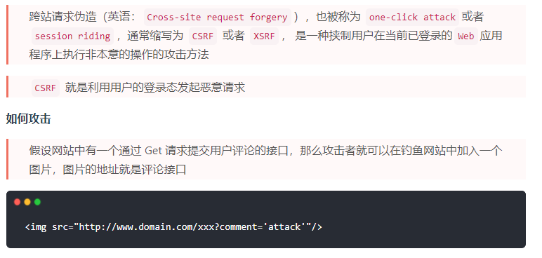

# 运行环境篇
- 运行环境即浏览器（或nodejs）
- 下载网页代码，渲染出页面，期间会执行若干js
- 要保障代码在浏览器中：稳定且高效

### 内容
- 网页加载过程
- 性能优化
- 安全


### 1. 网页加载过程
- 输入url到渲染出页面的整个过程
- window.onload 和DOMContentLoaded的区别

#### 输入url到渲染出页面的整个过程
- 加载资源的形式
  - html代码
  - 媒体文件，如图片，音视频等
  - js、css
- 加载过程
  - DNS解析：域名->IP地址（可能不同区域解析出不同的IP地址）
  - 浏览器根据IP地址向浏览器发起http请求
  - 服务器处理http请求，并返回给浏览器
- 渲染过程
  - 根据HTML代码生成DOM Tree
  - 根据css代码生成CSSOM
  - 将DOM Tree和CSSOM整合成Render Tree
  - 根据Render Tree渲染页面
  - 遇到script标签则暂停渲染，优先加载并执行js代码，完成再继续（共用同一线程）
  - 直至把Render Tree渲染完成

**思考**  
- css放在head标签中比css放在body标签尾部少了一次构建RenderTree, 一次计算布局和一次渲染网页, 性能会更好; 并且css放在body标签尾部时会在网页中短暂出现"裸奔"的HTML  
- js放body底部：避免阻塞渲染

#### window.onload 和DOMContentLoaded的区别
- window.onload()方法是必须等到页面内包括图片的所有元素加载完毕后才能执行。
- DOMContentLoaded是DOM结构绘制完毕后就执行，不必等到图片、视频等加载完毕

### 2. 性能优化
- 优化原则
  - 多使用内存、缓存或其他方法
  - 减少cpu计算量，减少网络加载耗时 
- 优化方向
  - 让加载更快
    - 减少资源体积：如压缩代码、分割代码
    - 减少访问次数，合并代码，ssr服务端渲染，缓存
    - 使用更快的网络：CDN加速
  - 让渲染更快
    - css 放在head中，js放在body最下面
    - 如需尽早开始执行js，用DOMContentLoaded触发
    - 懒加载（图片懒加载、上滑加载更多等）
    - 对DOM查询进行缓存，比如for循环中
    - 频繁DOM操作，合并到一起插入DOM结构
    - 节流throttle防抖debounce

**防抖debounce**  
防抖动是将多次执行变为最后一次执行
```js
function debounce (fn, delay = 500) {
  // timer 是闭包中的
  let timer = null
  return function () {
    if (timer) {
      clearTimeout(timer)
    }
    timer = setTimeout(() => {
      fn.apply(this, arguments)
      timer = null
    }, delay)
  }
}
```
**节流throttle**  
节流是将多次执行变成每隔一段时间执行
```js
function throttle (fn, delay = 100) {
  let timer = null
  return function () {
    if (timer) {
      return
    }
    timer = setTimeout(() => {
      fn.apply(this, arguments)
      timer = null
    }, delay)
  }
}

```
### 3. 安全
常见的web前端攻击方式有哪些  

#### XSS跨站请求攻击
  - 它允许恶意使用者将程式码注入到网页上，其他使用者在观看网页时就会受到影响这类攻击通常包含了 HTML 以及使用者端脚本语言
  - XSS 通过修改 HTML节点或者执行 JS代码来攻击网站。
  - 如：输入可能会将 HTML 改为 `<div><script>alert(1)</script></div> `，这样面中就凭空多了一段可执行脚本

 **如何防御**
 

#### XSRF跨站请求伪造
  


**如何防御**
- 使用post接口
- 增加验证,例如密码、短信验证码，指纹等