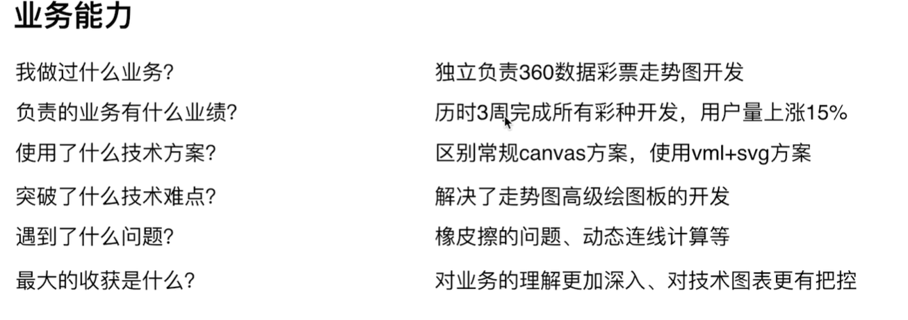

## 1、面试的环节和流程
- 员工内推  
- 猎头推荐  
- hr收集(网上投递简历)  

##### 一面：
考察基础知识

##### 二面（交叉面试）：
基础知识、框架原理、项目经验、解决方案   
交叉面试：多人考察，找不同部分面试官面试之类  
##### 三面
项目leader 项目介绍 岗位角色定位 未来工作计划

##### hr面试   
放低姿态，正常发挥

## 2、JD分析（岗位分析）
- 职位描述  
  - 工作内容  
- 岗位要求  
  - 技术栈、经验要求

## 3、如何写简历
#### 简历包含的内容(不要多，按顺序写)  
##### 1）个人信息：  
必备：姓名 性别 电话 邮箱 籍贯  
可选：年龄

##### 2）教育经历：
写上最高学历、学校、专业、入学和毕业时间

##### 3）专业技能
核心竞争力（达到用人要求）  
3-5条即可  
太基础的不要写  

##### 4）工作经历
如实写  
写明公司/职位/入职离职时间  

##### 5）项目经历
写2-4个具有说服力的项目（视工作经验）  
项目描述、技术栈、个人角色  
技巧：可以把别人的项目写上，只要能hold住  

##### 6）博客和开源（可选）
有博客或者开源作品，会让你更有竞争力  

#### 简历中需要注意的问题

内容简洁、直击重点，表现出自己的优势（满足用人单位要求）

## 4、准备工作和注意事项 
界面简洁明了，不要花哨  
注意用词，精通 熟练等慎用  
不要造假  

## 5、面试前的准备工作
- 看JD，是否需要临时准备一下  
- 打印纸质简历，带着纸笔  
- 有时间观念，不要迟到  
- 衣着适当，无需正装  
- 为何离职？=> 不要吐槽前东家，说自己的原因  
- 能加班吗？=> 能  
- 不要挑战面试官，即使他错了  
- 遇到不会的问题，要表现出自己积极的一面（故作思考，请求面试官引导、表示面试后再好好研究研究）  

项目准备举例：

