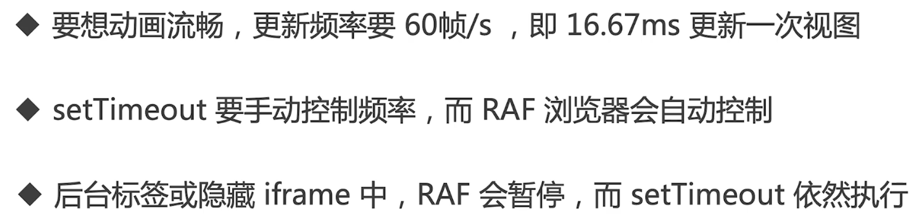

# 部分面试真题
### var let const 区别
关键词：变量提升、块级作用域、暂时性死区、可修改及不可修改性

### typeof能判断哪些类型
- undefined string number boolean symbol
- object(注意null)
- functions

### 列举强制类型抓换和隐式类型转换
- 强制：parseInt、parseFloat、toString、Number等
- 隐式：if、逻辑运算、==、+拼接字符串等

### 手写深度比较、模拟lodash isEqual
```js
// 判断是否是对象或数组
function isObject (obj) {
  return typeof obj === 'object' && obj !== null
}
// 全相等（深度）
function isEqual (obj1, obj2) {
  if (!isObject(obj1) || !isObject(obj2)) {
    // 值类型（注意，参与 equal 的一般不会是函数）
    return obj1 === obj2
  }
  if (obj1 === obj2) {
    return true
  }
  // 两个都是对象或数组，而且不相等
  // 1. 先取出 obj1 和 obj2 的 keys ，比较个数
  const obj1Keys = Object.keys(obj1)
  const obj2Keys = Object.keys(obj2)
  if (obj1Keys.length !== obj2Keys.length) {
    return false
  }
  // 2. 以 obj1 为基准，和 obj2 一次递归比较
  for (let key in obj1) {
    // 比较当前 key 的 val —— 递归！！！
    const res = isEqual(obj1[key], obj2[key])
    if (!res) {
      return false
    }
  }
  // 3. 全相等
  return true
}
```
### split()和join()的区别
拆分成数组，组合成字符串

### 数组常见api pop push unshift shift
功能、返回值、是否影响原数组  

#### 扩展:api中哪些是纯函数
不影响源数组，返回新数组
- concat
- map
- filter
- slice

### slice和splice的区别
- 功能区别，slice切取，splice剪接
- slice纯函数，splice非纯函数

### [10,20,30].map(parseInt)返回结果是什么
parseInt(10,0)  
parseInt(20,1)  
parseInt(30,2)  
[10,NaN,NaN]

### ajax get 和post请求的区别
- get一般用于查询，post一般用于用户提交操作
- get参数拼接在url上，post放在请求体内（数据体积可以更大）
- 安全性：post易防止SXRF攻击

### 函数call和apply的区别
call参数是拆分的，apply参数是数组或类数组

### 事件代理（委托）是什么
   - 又称事件委托。"事件代理"即是把原本需要绑定的事件委托给父元素，让父元素担当事件监听的职务。
   - 事件代理的原理是DOM元素的事件冒泡。
   - 使用事件代理的好处是可以提高性能：可以大量节省内存占用，减少事件注册 

### 闭包是什么，有何特点？有何负面影响
- 有权访问另一个函数作用域中变量的函数，创建闭包的最常见的方式就是在一个函数内创建另一个函数，通过另一个函数访问这个函数的局部变量，利用闭包可以突破作用链域

闭包的特性：
- 函数内再嵌套函数
- 内部函数可以引用外层的参数和变量
- 参数和变量不会被垃圾回收机制回收
  
**使用闭包的注意点**
- 由于闭包会使得函数中的变量都被保存在内存中，内存消耗很大，所以不能滥用闭包，否则会造成网页的性能问题，在IE中可能导致内存泄露
- 解决方法是，在退出函数之前，将不使用的局部变量全部删除
  
### 如何阻止事件冒泡和默认行为
event.stopPropagation()、event.preventDefault()

### 查找、添加、删除、移动DOM节点的方法
[参考JS-Web-API一节](./JS-Web-api.md)

### 如果减少DOM操作
[参考JS-Web-API一节](./JS-Web-api.md)

### 解释jsonp的原理，为何它不是真正的ajax
- 浏览器的同源策略（服务端没有此策略）和跨域
- 哪些html标签能绕过跨域，script、img、css
- jsonp原理其实是利用script标签能绕过跨域的特性

### window.onload 和DOMContentLoaded的区别
- window.onload()方法是必须等到页面内包括图片的所有元素加载完毕后才能执行。
- DOMContentLoaded是DOM结构绘制完毕后就执行，不必等到图片、视频等加载完毕

### ==和===区别
==会尝试类型转换，===严格相等（类型及值）

### 函数声明和函数表达式的区别
定义方式不同，且函数声明会在代码执行前预加载，函数表达式则不会

### new Object()和Object.create()的区别
- {}等同于new Object()，原型Object.prototype
```js
Object.prototype.__proto__===null;
new Object(obj1)===obj1`
```
- Object.create(null)，没有原型
- Object.create(obj)，原型是obj

### this场景题
参考js基础

### 关于作用域和自由变量的场景题
```js
let a
for (var i = 0; i < 10; i++) {
    a = document.createElement('a')
    a.innerHTML = i + '<br>'
    a.addEventListener('click', function (e) {
        e.preventDefault()
        console.log(i)
    })
    document.body.appendChild(a)
}
```

### 判断字符串以字母开头，后面字母数字下划线，长度6-30
 主要是正则基础概念及语法，自行学习  
 `const reg=/^[a-zA-Z]\w{5,29}/$`  

### 手写字符串trim方法，保证浏览器兼容性
```js
// 正则替换
String.prototype.trim = function(){
  return this.replace(/^\s+/,'').replace(/\s+$/,'')
}
```
### 如何获取多个值中的最大值
Math.max(arr)  
循环比较

### 如何捕获js程序中的异常
try catch、window.onerror

### 什么是json
- 是一种数据格式，本质是一段字符串
- json格式和js对象结构一致，对js语言友好
- JSON.parse、JSON.stringify
- key必须用双引号括起来
  
### 获取url中的参数
```js
// 传统方式
function query (name) {
  const search = location.search.substr(1) // 类似 array.slice(1)
  // search: 'a=10&b=20&c=30'
  // 或者用split拆分
  const reg = new RegExp(`(^|&)${name}=([^&]*)(&|$)`, 'i')
  const res = search.match(reg)
  if (res === null) {
    return null
  }
  return res[2]
}

// URLSearchParams
function query (name) {
  const search = location.search
  const p = new URLSearchParams(search)
  return p.get(name)
}
```

### 手写数组flatern，考虑多层级
```js
function flat (arr) {
  // 验证 arr 中，还有没有深层数组 [1, 2, [3, 4]]
  const isDeep = arr.some(item => item instanceof Array)
  if (!isDeep) {
    return arr // 已经是 flatern [1, 2, 3, 4]
  }

  const res = Array.prototype.concat.apply([], arr)
  return flat(res) // 递归
}

```
### 数组去重
```js
// 传统方式
function unique (arr) {
  const res = []
  arr.forEach(item => {
    if (res.indexOf(item) < 0) {
      res.push(item)
    }
  })
  return res
}

// 使用 Set （无序，不能重复）
function unique (arr) {
  const set = new Set(arr)
  return [...set]
}
```

### 介绍下requestAnimationFrame



```js
// 3s 把宽度从 100px 变为 640px ，即增加 540px
// 60帧/s ，3s 180 帧 ，每次变化 3px

const $div1 = $('#div1')
let curWidth = 100
const maxWidth = 640

// // setTimeout
// function animate() {
//     curWidth = curWidth + 3
//     $div1.css('width', curWidth)
//     if (curWidth < maxWidth) {
//         setTimeout(animate, 16.7) // 自己控制时间
//     }
// }
// animate()

// RAF
function animate () {
  curWidth = curWidth + 3
  $div1.css('width', curWidth)
  if (curWidth < maxWidth) {
    window.requestAnimationFrame(animate) // 时间不用自己控制
  }
}
animate()

```