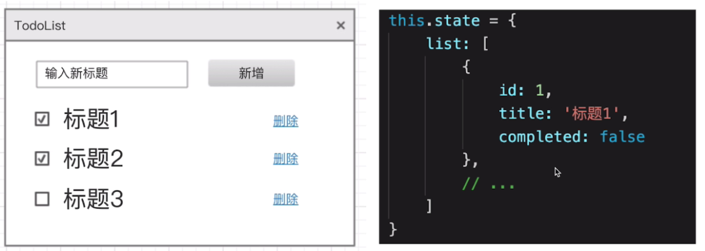
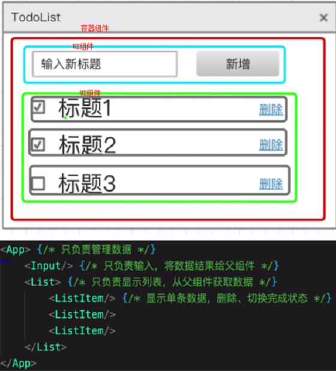
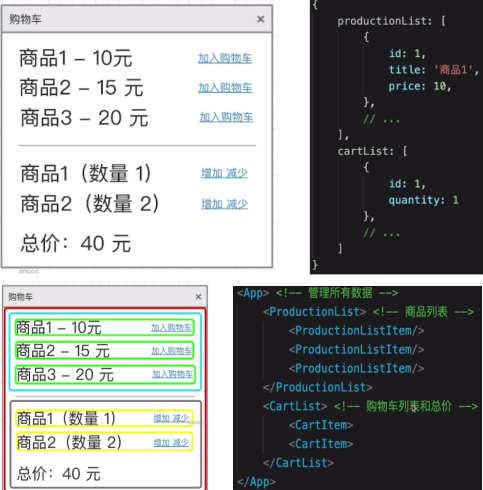

# 项目设计篇

组件和状态设计  
框架的使用（和高级特性）是必要条件  
能独立负责项目？还是需要人带？——考察设计能力  
面试必考（二面、三面），场景题

### 项目设计考察重点

数据驱动视图  
状态：数据结构设计（React-state，Vue-data）  
视图：组件结构和拆分

### 面试题案例：

#### 1：React 设计 todolist（组件结构，redux state 数据结构）

#### 2：Vue 设计购物车（组件结构，vuex state 数据结构）

状态设计的思路和要点  
组件设计的思路和要点

#### 1：React 设计 todolist（组件结构，redux state 数据结构）

state 数据结构设计  
组件设计（拆分、组合）和组件通讯  
代码演示

#### 参考范式：

##### 第一步：设想原型图（功能点）

##### 第二步：设计数据结构（注意 3 个原则）

1）数据描述所有内容  
2）数据要结构化、易于程序操作（遍历、查找）  
3）数据要可扩展、以便增加新的功能

#### 第三步：组件设计（注意 3 个原则）

1）从功能上拆分层次  
2）尽量让组件原子化（一个组件干一件事，吸收复杂度）  
3）容器组件（只管理数据）和 UI 组件（只显示视图）

第四步：代码实现

2：Vue 设计购物车（组件结构，vuex state 数据结构）
参考之前步骤：
第一步：设想原型图（功能点）
第二步：设计数据结构（注意 3 个原则）
第三步：组件设计（注意 3 个原则）
第四步：代码实现

