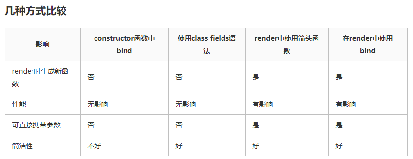
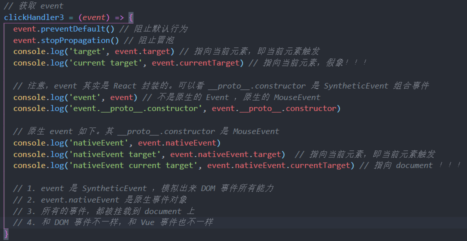
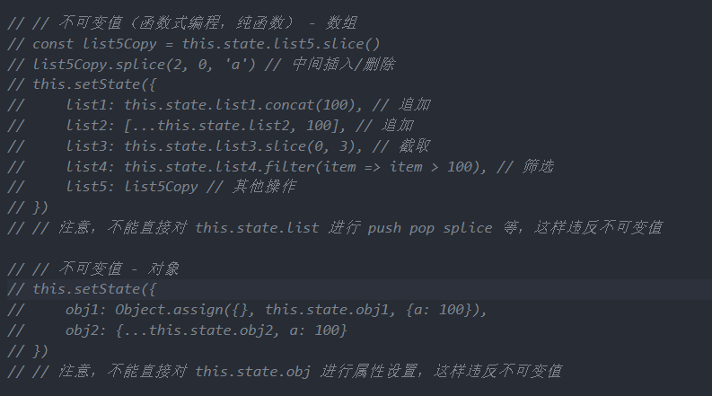
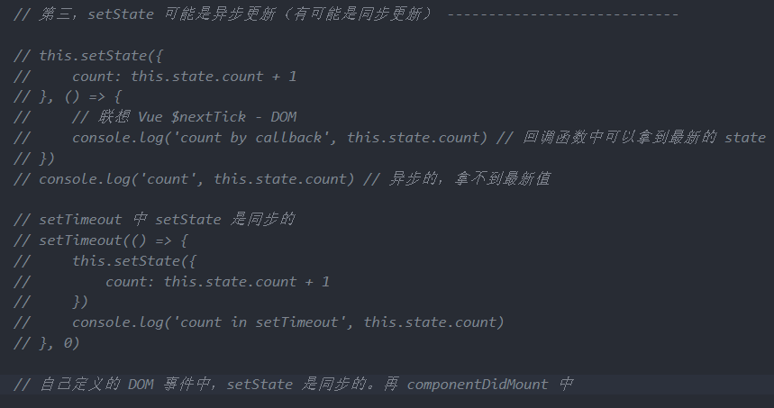
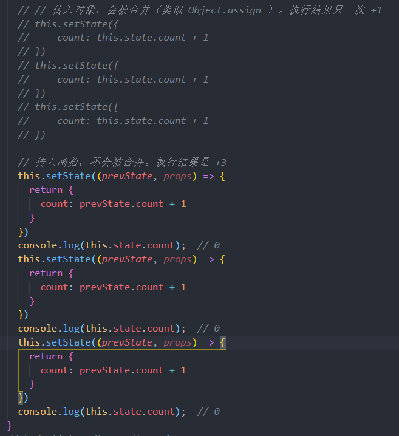
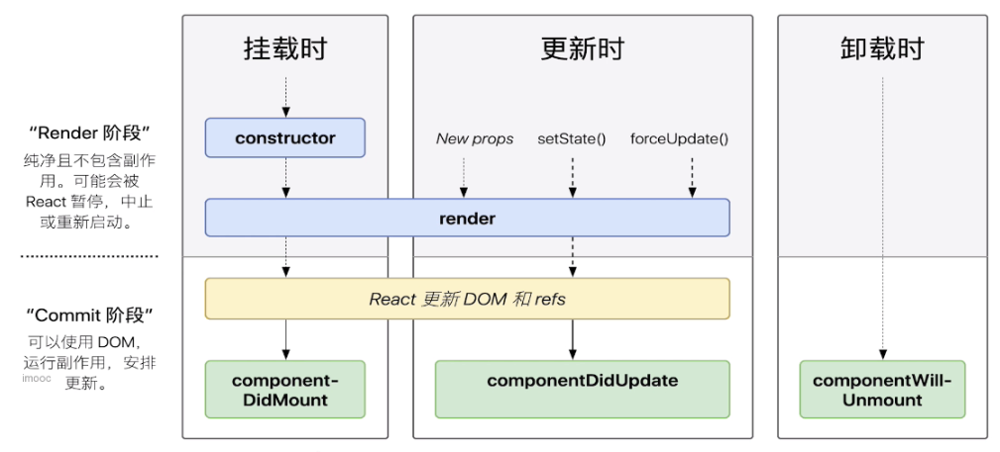
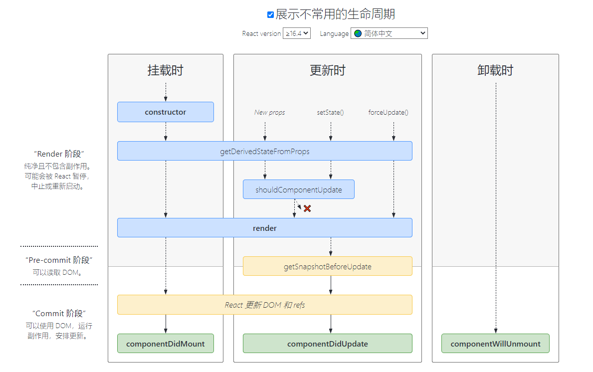
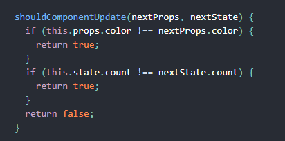
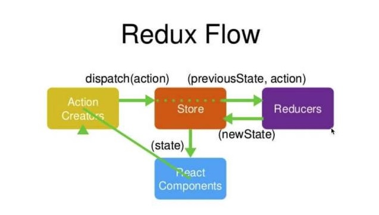

# React 篇

## 事件（重点）

React 事件的命名采用小驼峰式（camelCase），而不是纯小写。  
使用 JSX 语法时你需要传入一个函数作为事件处理函数，而不是一个字符串。  
不能通过返回 false 的方式阻止默认行为。你必须显式的使用 preventDefault

1）bind this（三种形式，使用类时：构造函数内绑定 this、class fields、回调中使用箭头函数）  
回调中使用箭头函数在于每次渲染 LoggingButton 时都会创建不同的回调函数。在大多数情况下，这没什么问题，但如果该回调函数作为 prop 传入子组件时，这些组件可能会进行额外的重新渲染



2）关于 event 参数（重要）  
参考之后章节



3）传递自定义参数

```js
<button onClick={(e) => this.deleteRow(id, e)}>Delete Row</button>
<button onClick={this.deleteRow.bind(this, id)}>Delete Row</button>
```

上述两种方式是等价的，分别通过箭头函数和 Function.prototype.bind 来实现。

## setState（非常重要）

1）不可变值(注意)

```js
// 不要直接修改 state ，使用不可变值，构造函数是唯一可以给 this.state 赋值的地方
// this.state.count++ // 错误,如违反不可变值原则,会影响 shouldComponentUpdate
// this.setState({
//     count: this.state.count + 1
// })
```



2）可能是异步更新（三种情况）

1. 普通使用是异步的；
2. setTimeout/setInterval/自定义 DOM 事件回调中是同步的
   具体原因可以参考后面章节的 batchUpdate 机制



3）可能会被合并

1. 传入对象会被合并；
2. 传入函数则不会被合并



## 组件生命周期（重要、会画）

[生命周期参考]('http://projects.wojtekmaj.pl/react-lifecycle-methods-diagram/')



可以关注下 shouldComponentUpdate，其他的无需关注



父子组件生命周期和 vue 完全一样

## 高级特性

1. 函数组件
2. 非受控组件
3. Portals
4. context
5. 异步组件
6. 性能优化
7. 高阶组件 HOC
8. Render Props

## 性能优化（针对 React，性能优化是重点）

性能优化对 React 更加重要  
1）shouldComponentUpdate

1. React 默认：父组件更新，则子组件无条件更新，默认返回 true
2. SCU 一定要每次都用吗？不一定，需要时才优化
3. 当用户输入不规范时，直接操作 state，如 this.state.list.push(xx)，SCU 将不再有效果，故 SCU 必须配合不可变值书写



2）PureComponent/React.memo  
PureComponent，SCU 中实现了浅比较（只比较第一层）  
Memo：函数组件中的 PureComponent  
浅比较已经适用大部分内容，state 层级尽量低（尽量避免深度比较，耗费性能 ）

3）不可变值 immutable.js（了解）  
彻底拥抱不可变值
基于共享数据（不是深拷贝），速度快

## 关于组件公共逻辑的抽离

1. Mixin，已被 React 弃用
2. 高阶组件 HOC（注意透传所有 props） 需要重新组织你的组件结构，这可能会很麻烦，使你的代码难以理解
3. Render Props 需要重新组织你的组件结构，这可能会很麻烦，使你的代码难以理解
4. hook Hook 使你在无需修改组件结构的情况下复用状态逻辑，Hook 允许我们按照代码的用途分离他们， 而不是像生命周期函数那样

## Redux 的使用（常考）

基本概念  
store state  
action  
reducer  
dispatch(action)  
reducer => newState  
subscribe 触发通知

react-redux  
Provider  
connect  
mapStateToProps 及 mapDispatchToProps

Redux 处理异步  
redux-thunk

```js
const actions = {
  ...
  incrementAsync: (num) => {
    // 返回函数，携带dispatch参数
    return dispatch => {
      setTimeout(() => {
        console.log('INCREMENTASYNC');
        dispatch({ type: constants.INCREMENTBYAMOUNT, payload: num })
      }, 1000)
    }
  }
}
---------------------------------------------------
import { combineReducers } from 'redux'
import count from './count'
import user from './user'
const rootReducer = combineReducers({
  count,
  user
})

export default rootReducer
---------------------------------------------------
import { createStore, applyMiddleware } from 'redux';
import thunk from 'redux-thunk' // 异步action
import rootReducer from './reducer/index' // combineReducers
import { composeWithDevTools } from 'redux-devtools-extension'; // 配合开发工具
const store = createStore(rootReducer, composeWithDevTools(applyMiddleware(thunk)))
export default store
```

## React 原理

### 1：牢记不可变值

### 2：vdom 和 diff

h 函数  
vnode 数据结构  
patch 函数

1. 只比较同一层级，不跨级比较
2. tag 不同，则删除重建，不再深度比较
3. tag 和 key，两者都相同，则认为是相同节点，不再深度比较  
   大大降低了 diff 计算复杂度

Vue2.x、Vue3.0、React 三者实现 vdom 细节都不同  
核心概念和实现思路，都一样  
面试主要考察核心概念和实现思路，非全部核心细节

### 3：JSX 本质

JSX 等同于 Vue 模板  
Vue 模板非 html  
JSX 也不是 js  
(babel 网站中可以编译试一试)

```js
React.createElement('div', null, [child1, child2, child3]);
React.createElement('div', null, child1, child2, child3);
React.createElement(List, null, [child1, child2, child3]);
// 通过参数1首字母大写判断是否是React组件
```

JSX 的本质就是一个 React.createElement 函数，即 h 函数，他接收多个参数来返回 Vnode  
第一个参数，可能是组件，也可能是 html tag  
组件名称在 JSX 中首字母必须大小写（区分 h 函数的第一个参数是 html tag string，还是个组件变量名）

### 4：React 的合成事件

所有事件都挂载在 document 中  
event 不是原生的，是 SyntheticEvent 合成事件对象  
和 Vue 事件不同，和 DOM 事件也不同


为什么要使用合成事件机制：

1. 抹平浏览器之间的兼容性差异。 这是估计最原始的动机。

2. 事件"合成", 即事件自定义。事件合成除了处理兼容性问题，还可以用来自定义高级事件，比较典型的是 React 的 onChange 事件，它为表单元素定义了统一的值变动事件。

3. 抽象跨平台事件机制。 和 VirtualDOM 的意义差不多，VirtualDOM 抽象了跨平台的渲染方式，那么对应的 SyntheticEvent 目的也是想提供一个抽象的跨平台事件机制。

4. React 打算做更多优化。比如利用事件委托机制，大部分事件最终绑定到了 Document，而不是 DOM 节点本身. 这样简化了 DOM 事件处理逻辑，减少了内存开销。 但这也意味着，React 需要自己模拟一套事件冒泡的机制。

5. React 打算干预事件的分发。v16 引入 Fiber 架构，React 为了优化用户的交互体验，会干预事件的分发。不同类型的事件有不同的优先级，比如高优先级的事件可以中断渲染，让用户代码可以及时响应用户交互。

### 5：setState 和 batchUpdate

有时异步（普通使用）有时同步（setTimeout/自定义 DOM 事件）  
有时合并（对象形式），有时不合并（函数形式）  
1：setState 主流程  
2：batchUpdate 机制  
[setState 主流程及 batchUpdate 机制](https://blog.csdn.net/qq_39207948/article/details/113803273)

setState 无所谓异步还是同步，看是否命中 batchUpdate 机制，判断 isBatchingUpdates

#### 哪些能命中 batchUpdate 机制：

1）生命周期（和它调用的函数）  
2）React 中注册的事件（和它调用的函数）  
3）React 可以管理的入口

#### 哪些不能命中 batchUpdate 机制：

1）setTimeout/setInterval 等（和它调用的函数）  
2）自定义的 DOM 事件（和它调用的函数）  
3）React 管不到的入口

#### transaction(事务)机制

[transaction(事务)机制](https://blog.csdn.net/qq_39207948/article/details/113803273)

#### 组件渲染和更新过程

JSX 如何渲染为页面  
setState 之后如何更新页面  
组件渲染:  
1）props/state  
2）render()生成 vnode  
3）patch(elem,vnode)  
组件更新：  
1）setState(newState)=>dirthComponents(可能含有子组件)  
2）render()生成 newVode  
3）patch(vnode, newVnode)

更新的两个阶段  
上述的 patch 被拆分成两个阶段：  
1）reconciliation 阶段，执行 diff 算法，纯 js 计算  
2）commit 阶段，将 diff 结果渲染成 dom  
可能会有性能问题：

1. js 是单线程，且和 DOM 渲染共用一个线程
2. 当组件足够复杂，组件更新时计算和渲染的压力都很大
3. 同时再有 DOM 操作需求（动画、鼠标拖拽等），页面将卡顿

React fiber 如何优化性能：

1. 将 reconciliation 阶段进行任务拆分（commit 无法拆分）
2. DOM 需要渲染时暂停，空闲时恢复
3. window.requestIdleCallback（了解即可）
   备注：window.requestIdleCallback()方法将在浏览器的空闲时段内调用的函数排队。这使开发者能够在主事件循环上执行后台和低优先级工作，而不会影响延迟关键事件，如动画和输入响应。函数一般会按先进先调用的顺序执行，然而，如果回调函数指定了执行超时时间 timeout，则有可能为了在超时前执行函数而打乱执行顺序

## React 真题演练

### 组件间如何通讯

1.父子组件：  
props（子=父 父组件将一个函数作为 props 传递给子组件，子组件调用该回调函数）  
2.跨级组件：  
层层传递 props 或者 Context  
3.非嵌套组件间通信：
Redux 或者自定义事件（了解即可，如`import { EventEmitter } from "events";`）

### shouldComponentUpdate 用途

性能优化  
(配合"不可变值"一起使用，否则会出错)  
shouldComponentUpdate 函数是重渲染时 render()函数调用前被调用的函数，它接受两个参数：nextProps 和 nextState，分别表示下一个 props 和下一个 state 的值。并且，当函数返回 false 时候，阻止接下来的 render()函数的调用，阻止组件重渲染，而返回 true 时，组件照常重渲染。组件默认返回 true，通过自定义判断是否需要重渲染，来实现性能优化

### redux 单向数据流

redux 单向数据流以 store 为核心，我们把它看成数据存储中心，但不能直接修改，数据修改更新的角色必须由 Reducers 来担任, store 只做存储，当 Reducers 的更新完成以后会通过 store 的订阅来通知 react component，组件把新的状态重新获取渲染。组件中我们也能主动发送 action，创建 action 后这个动作是不会执行的，所以要 dispatch 这个 action，让 store 通过 reducers 去做更新。
形成 action=>dispatch(action)=>reducers=>store=>react component 的单向数据流


### setState 场景题

```js
class ListDemo extends React.Component {
  constructor(props) {
    super(props);
    this.state = {
      count: 0,
    };
  }
  render() {
    return <p>{this.state.count}</p>;
  }
  componentDidMount() {
    // count 初始值为 0
    this.setState({ count: this.state.count + 1 });
    console.log('1', this.state.count); // 0
    this.setState({ count: this.state.count + 1 });
    console.log('2', this.state.count); // 0
    setTimeout(() => {
      this.setState({ count: this.state.count + 1 });
      console.log('3', this.state.count); // 2
    });
    setTimeout(() => {
      this.setState({ count: this.state.count + 1 });
      console.log('4', this.state.count); // 3
    });
  }
}
```

### React 发起 ajax 应该在哪个生命周期

componentDidMount

- 1.React 下一代调和算法 Fiber 会通过开始或停止渲染的方式优化应用性能，其会影响到 componentWillMount 的触发次数。对于 componentWillMount 这个生命周期函数的调用次数会变得不确定，React 可能会多次频繁调用 componentWillMount。如果我们将 AJAX 请求放到 componentWillMount 函数中，那么显而易见其会被触发多次，自然也就不是好的选择。
- 2.如果我们将 AJAX 请求放置在生命周期的其他函数中，我们并不能保证请求仅在组件挂载完毕后才会要求响应。如果我们的数据请求在组件挂载之前就完成，并且调用了 setState 函数将数据添加到组件状态中，对于未挂载的组件则会报错。而在 componentDidMount 函数中进行 AJAX 请求则能有效避免这个问题。

### pureComponent 有何作用

实现了浅比较的 SCU  
性能优化  
需要结合不可变值的使用

### React 事件和 DOM 事件的区别

React 所有事件都挂载在 document 中，DOM 事件挂载在注册的 DOM 上  
React event 不是原生的，是 SyntheticEvent 合成事件对象

### React 性能优化

1. 渲染列表使用 key
2. 自定义事件、定时器、DOM 事件等及时销毁
3. 合理使用异步组件
4. 减少函数 bind this 的次数（因为这样每次 render 都会进行一次 bind 操作消耗性能）
5. 合理使用 SCU PureComponent 和 memo
6. Webpack 层面的优化
7. 前端通用的性能优化，如图片懒加载

### React 和 Vue 的区别

共同点：
都支持组件化  
都是数据驱动视图  
都使用 vdom 操作 DOM

区别：
React 使用 JSX 拥抱 JS，Vue 使用模板拥抱 html  
React 函数式编程，Vue 声明式编程  
React 更加灵活，需要自力更生，Vue 把想要的都给你，添加了很多用法  
[函数式编程和声明式编程说明](https://github.com/morganfly/morganfly_blog/issues/24)

### Vue2 Vue3 React 三者 diff 算法有何区别

如果严格 diff 两棵树，时间复杂度 O(n^3)，不可用

tree diff 的优化
只比较同一层级，不跨级比较
tag 不同则删掉重建，不再比较内部细节
子节点通过 key 区分（key 很重要）

优化后的时间复杂度为 O(n)

详细看视频
react diff - 仅右移
vue2 diff - 双端比较
vue3 diff - 最长递增子序列

vdom diff 算法会根据 key 判断元素是否要删除
匹配了 key，则只需要移动元素，性能较好
未匹配 key，则删除重建，性能差
