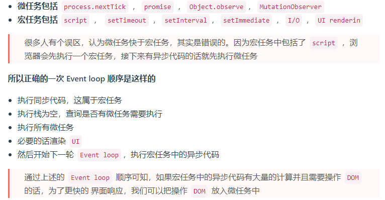

# Garbage collection 垃圾回收

垃圾回收：回收不再需要使用的内存
内存泄露：非预期的内存无法回收

垃圾回收算法：
1、引用计数（旧的方案，缺陷：循环引用怎么解决？）
2、标记清除 (现代方案)
通过根节点，也就是全局（window），标记所有从根节点开始的能够访问到的对象。未被标记的对象就是未被全局引用的垃圾对象，最终清除所有未被标记的对象。

闭包算内存泄漏吗？
不算，虽然闭包的内存不会被回收，但是符合预期的，并不是非预期的内存无法回收

# 如何检测内存泄漏，场景有哪些

chrome devTools 的 performance 模块 memory 工具
内存泄漏场景举例：
被全局变量、函数引用，组件销毁时未被清除
被全局事件、定时器引用，组件销毁时未被清除
被自定义事件引用，组件销毁时未被清除（eventEmiter 之类）

扩展：weakMap、weakSet 弱引用

# 浏览器和 nodejs 的事件循环有什么关系

宏任务队列 Macrotask Queue
微任务队列 Microtask Queue

## 浏览器

- 单线程和异步
- 浏览器中 js 执行和 DOM 渲染共用一个线程
- 宏任务： 如 setTimeout、setInterval、网络请求
- 微任务：如 promise、async/await
- 微任务在下一轮 DOM 渲染之前执行、宏任务在之后执行

## 浏览器 event loop

- js 是单线程运行的，如果 JS 是门多线程的语言话，我们在多个线程中处理 DOM 就可能会发生问题（一个线程中新加节点，另一个线程中删除节点）
- 异步是基于回调来实现的
- DOM 事件（不是异步，只是都基于事件循环）也是使用回调，也是基于 event loop
- event loop 就是异步回调的实现原理，本质上来说 JS 中的异步还是同步行为

## nodejs

- 单线程和同步
- 异步任务也分为宏任务和微任务
- 宏任务和微任务分不同类型，有不同优先级，如：setImmediate、process.nextTick、setTimeout、setInterval
- 宏任务类型和优先级(从高到低)
  - Timers (setTimeout, setInterval)
  - I/O callbacks - 处理网络、流、TCP 的错误回调
  - Idle, prepare - 闲置状态（nodejs 内部使用）
  - Poll 轮询 - 执行 poll 中的 I/O 队列
  - Check 检查 - 存储 setImmediate 回调
  - Close callbacks - 关闭回调，如 socket.on('close')
- 微任务类型和优先级(从高到低)
  - process.nextTick
  - Promise、async/await

## nodejs event loop

- 执行同步代码
- 执行微任务（process.nextTick 优先级更高）
- 按顺序执行 6 个类型的宏任务（每个开始之前都执行当前的微任务）

- 浏览器和 nodejs 的 event loop 流程基本相同
- nodejs 宏任务和微任务分类型，有优先级！！！（浏览器是不分的）
- 推荐使用 setImmediate（宏任务） 代替 process.nextTick（因为 process.nextTick 优先级太高了）

# 虚拟 dom（vdom） 真的很快吗

- 用 js 对象模拟 DOM 节点数据
- Vue、React 等框架的价值
  1.  组件化
  2.  数据与视图分离，数据驱动视图---核心
  3.  只关心业务数据，而不用关心 DOM 变化

vdom 并不快，js 直接操作 DOM 才是最快的，但数据驱动视图要有合适的技术方案，不能全部重建 DOM，vdom 就是目前最合适的技术方案（不是因为快，而是合适），数据驱动视图大大提升了开发体验

# 遍历数组，for 和 forEach 谁更快

- for 更快
- forEach 每次都要创建一个函数来调用，而 for 就不用
- 函数需要独立的作用域，会有额外的开销
- 越低级的代码，性能往往越好（同复杂度的前提下）
- 循环 vs 递归

# nodejs 如何开启多进程(进程而不是线程，js 开启不了多线程！！！)，进程如何通讯

- 进程 process vs 线程 thread
- 进程： OS 进行资源分配和调度的最小单位，有独立内存空间
- 线程： OS 进行运算调度的最小单位，共享进程内存空间
- 一个进程可以包含多个线程
- js 是单线程的，但可以开启多个进程执行，如 webWorker
- 为何需要多进程
  - 多核 CPU，更适合处理多进程
  - 内存较大，多个进程才能更好利用（单进程有内存上限）
  - 压榨机器资源，更快更节省

方案 1：[child_process.fork](./codes/process/fork.js) + child.js
方法 2：[cluster.fork](./codes/process/cluster.js)

# js bridge 原理

## 什么是 js bridge

js 无法直接调用 native api
需要通过一些特定的”格式“来调用，这些”格式“就叫 js bridge，比如微信 js-sdk
是 js 和 native api 互相调用的桥梁

## js bridge 的常见实现方式

- 注册全局 api
- URl Scheme(推荐)

(JS Bridge 通信原理)[https://zhuanlan.zhihu.com/p/343317967]

详见 [codes/js-bridge.html](./codes/js-bridge.html)

# 是否了解过 requestIdleCallback，和 requestAnimationFrame 有啥区别

由 React fiber 引起的关注
组件树转换为链表，可实现分段渲染
任务可以暂停，去执行其他高优任务，空闲时再继续渲染
如何判断空闲？requestIdleCallback

requestAnimationFrame 每次渲染完都会执行，高优先级
requestIdleCallback 空闲时才执行，低优先级
两个都是宏任务，因为都要等待 DOM 渲染完成

[requestAnimationFrame](./codes/requestAnimationFrame.html)
[requestIdleCallback](./codes/requestIdleCallback.html)
